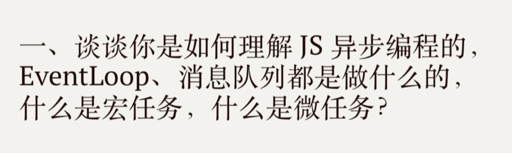

# 作业

## [学习笔记](/fed-e-task-01-01/notes/README.md)

## 简答题

Event Loop 用于等待和发送消息和事件。
Event Loop 它最主要是分三部分：主线程、宏任务（macrotask）、微任务（microtask）

### 宏任务

宏任务，macrotask，也叫 tasks。 一些异步任务的回调会依次进入 macro task queue，等待后续被调用，这些异步任务包括：

- setTimeout
- setInterval
- setImmediate
- I/O
- UI rendering

### 微任务

微任务，microtask，也叫 jobs。 另一些异步任务的回调会依次进入 micro task queue，等待后续被调用，这些异步任务包括：

- Promise
- Object.observe
- MutationObserver
- process.nextTick

### 执行顺序

主线程 > 微任务 > 宏任务

## 代码题

- [第一题](code/question-1)
- [第二题](code/question-2)
- [第三题](code/question-3)
- [第四题](code/question-4)
