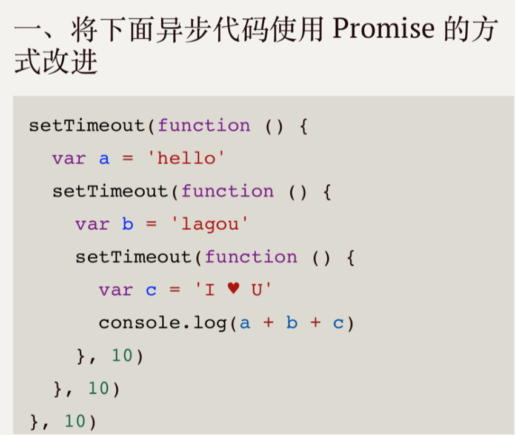

# 编程第一题

## 题目



## 解答

```javascript
Promise.resolve('hello')
  .then((value) => {
    return value + 'logou';
  })
  .then((value) => {
    return value + 'I ♥ U';
  })
  .then((value) => console.log(value));
```
