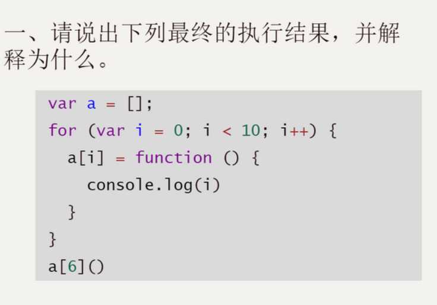
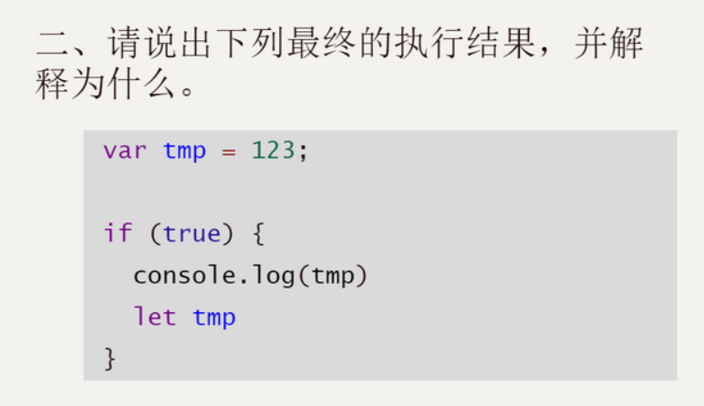
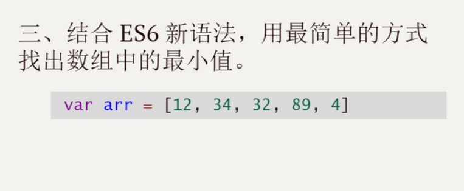
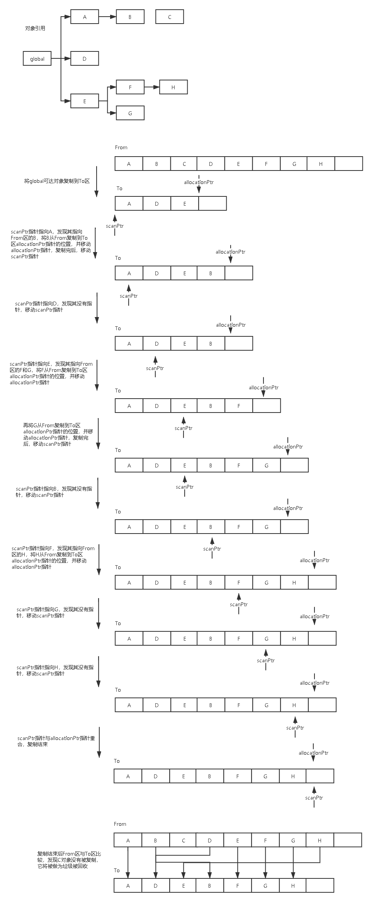

# 作业

## [学习笔记](/fed-e-task-01-02/notes/README.md)

## 简答题



最终执行结果输出是：10

因为 i 是全局变量，在执行完循环之后，i 被累加到了 10，所以这里输出的是 10



会报 ReferenceError 异常;

因为在块级作用域里通过 let 声明了 tmp，所以会先访问块级里的变量；而通过 let 声明的变量直到它们的定义被执行时才初始化，在变量初始化前访问该变量会导致 ReferenceError。



```javascript
let arr = [12, 34, 32, 89, 4];
arr.sort((x, y) => x - y);
let min = arr[0];
console.log(min);
```


| 声明方式 | 作用域                               | 初始化时间       | 能否重新赋值 |
| -------- | ------------------------------------ | ---------------- | ------------ |
| var      | 整个封闭函数                         | 在编译前初始化   | 能           |
| let      | 声明的变量只在其声明的块或子块中可用 | 在编译时才初始化 | 能           |
| const    | 声明的变量只在其声明的块或子块中可用 | 在编译时才初始化 | 不能         |

const 虽然不能重新赋值，但这并不意味着它所持有的值是不可变的，只是变量标识符不能重新分配。例如：

```javascript
const obj = {};
obj.name = 'heath'; // 这是允许的
```


输出结果：20

因为 fn 函数是 obj 对象的方法，所以箭头函数的 this 指针指向 obj 这个对象


每个从 Symbol()返回的 symbol 值都是唯一的。一个 symbol 值能作为对象属性的标识符；这是该数据类型仅有的作用。


> 浅拷贝

浅拷贝只是复制了内存地址，如果原地址中的对象改变了，浅拷贝出来的对象也会相应改变。

```javascript
let obj = { a: 0, b: 0, c: { d: 0 } };
let newObj = Object.assign({}, obj);
console.log(obj); // { a: 0, b: 0, c: { d: 0 } }
console.log(newObj); // { a: 0, b: 0, c: { d: 0 } }
obj.a = 1;
obj.c.d = 1;
console.log(obj); // { a: 1, b: 0, c: { d: 1 } }
console.log(newObj); // { a: 0, b: 0, c: { d: 1 } }
```

> 深拷贝

申请了一块新的内存存放地址和地址指向的对象，原地址的任何对象改变了，深拷贝出来的对象不变。

```javascript
let obj = { a: 0, b: 0, c: { d: 0 } };
let newObj = JSON.parse(JSON.stringify(obj));
console.log(obj); // { a: 0, b: 0, c: { d: 0 } }
console.log(newObj); // { a: 0, b: 0, c: { d: 0 } }
obj.a = 1;
obj.c.d = 1;
console.log(obj); // { a: 1, b: 0, c: { d: 1 } }
console.log(newObj); // { a: 0, b: 0, c: { d: 0 } }
```


TypeScript 是 JavaScript 类型的超集，可编译为普通 JavaScript。


> 优点

- TypeScript 是 JavaScript 类型的超集，可以直接使用 js 代码编辑

- TypeScript 是强类型语言，其在编译阶段，就可以发现大部分的问题

- TypeScript 增加了代码的可读性和可维护性

- TypeScript 提供了类、模块和接口，更易于构建组件。

> 缺点

- TypeScript 新增的接口，类的接口实现等新概念，对于前端人员而言不易于理解，学习成本较高

- 短期内可能增加开发成本，但是长期而言有利于维护

- 一些第三方库没有兼容 TypeScript


每个对象在创建的时候，就给这个对象绑定一个计数器。每当有一个引用指向该对象时，计数器加一；每当有一个指向它的引用被删除时，计数器减一。这样，当没有引用指向该对象时，该对象死亡，计数器为 0，这时就应该对这个对象进行垃圾回收操作。

> 优点

- 发现垃圾时，立即回收
- 最大限度减少程序暂停

> 缺点

- 无法回收循环引用的对象
- 时间开销大


这个算法假定设置一个叫做根（root）的对象（在 Javascript 里，根是全局对象）。垃圾回收器将定期从根开始，找所有从根开始引用的对象，对其进行标记，垃圾回收器将遍历所有对象清除没有标记的对象。


- 回收过程采用复制算法+标记整理
- 新生代内存区被等分为两个空间
- 使用空间为 From，空闲空间为 To
- 标记整理后将活动对象拷贝至 To
- From 和 To 交换空间完成释放
- 一轮 GC 还存活的新生代需要晋升
- 对象从 From 空间复制到 To 空间时，如果 To 空间已经被使用了超过 25%，那么这个对象直接被复制到老生代




老生代对象回收时，会使用增量标记算法。

由于全停顿会造成了浏览器一段时间无响应，所以 V8 使用了一种增量标记的方式，将完整的标记拆分成很多部分，每做完一部分就停下来，让 JS 的应用逻辑执行一会，这样垃圾回收与应用逻辑交替完成。经过增量标记的改进后，垃圾回收的最大停顿时间可以减少到原来的 1/6 左右


