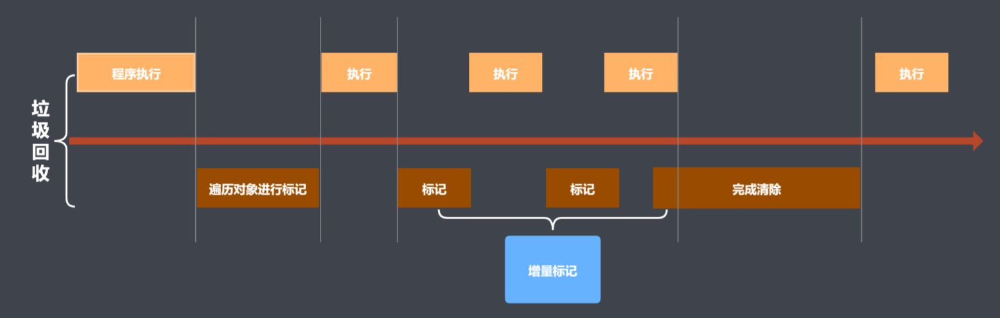

# V8(JavaScript 执行引擎)

- V8 引擎是一个 JavaScript 引擎实现，最初由一些语言方面专家设计，后被谷歌收购，随后谷歌对其进行了开源。
- V8 使用 C++开发，在运行 JavaScript 之前，相比其它的 JavaScript 的引擎转换成字节码或解释执行，V8 将其编译成原生机器码（IA-32, x86-64, ARM, or MIPS CPUs），并且使用了如内联缓存（inline caching）等方法来提高性能。
- 有了这些功能，JavaScript 程序在 V8 引擎下的运行速度媲美二进制程序。
- V8 支持众多操作系统，如 windows、linux、android 等，也支持其他硬件架构，如 IA32,X64,ARM 等，具有很好的可移植和跨平台特性。

## 内存管理

### V8 内存限制

> 限制大小

64 位为 1.4GB，32 位为 0.7GB

> 限制原因

V8 之所以限制了内存的大小，表面上的原因是 V8 最初是作为浏览器的 JavaScript 引擎而设计，不太可能遇到大量内存的场景，而深层次的原因则是由于 V8 的垃圾回收机制的限制。由于 V8 需要保证 JavaScript 应用逻辑与垃圾回收器所看到的不一样，V8 在执行垃圾回收时会阻塞 JavaScript 应用逻辑，直到垃圾回收结束再重新执行 JavaScript 应用逻辑，这种行为被称为“全停顿”（stop-the-world）。若 V8 的堆内存为 1.5GB，V8 做一次小的垃圾回收需要 50ms 以上，做一次非增量式的垃圾回收甚至要 1 秒以上。这样浏览器将在 1s 内失去对用户的响应，造成假死现象。如果有动画效果的话，动画的展现也将显著受到影响。

### V8 垃圾回收策略

- 采用分代回收的思想
- 内存分为新生代、老生代
- 针对新、老生代采用不同算法来提升垃圾回收的效率

新生代的对象为存活时间较短的对象，老生代中的对象为存活时间较长或常驻内存的对象。

#### V8 新生代、老生代内存大小

V8 引擎的新生代内存大小 32MB（64 位）、16MB（32 位），老生代内存大小为 1400MB（64 位）、700MB（ 32 位）。

#### 新生代对象回收实现

- 回收过程采用复制算法+标记整理
- 新生代内存区被等分为两个空间
- 使用空间为 From，空闲空间为 To
- 标记整理后将活动对象拷贝至 To
- From 和 To 交换空间完成释放

#### 晋升

将新生代对象移到老生代

> 晋升条件

- 一轮 GC 还存活的新生代需要晋升
- 对象从 From 空间复制到 To 空间时，如果 To 空间已经被使用了超过 25%，那么这个对象直接被复制到老生代

#### 老生代对象回收实现

- 主要采取标记清除、标记整理、增量标记算法
- 首先使用标记清除完成垃圾空间的回收
- 采用标记整理进行空间优化
- 采用增量标记进行效率优化

#### 细节对比

> 新生代区域，采用复制算法， 因此其每时每刻内部都有空闲空间的存在(为了完成 From 到 To 的对象复制)，但是新生代区域空间较小(32M)且被一分为二，所以这种空间上的浪费也是比较微不足道的。

> 老生代因其空间较大(1.4G),如果同样采用一分为二的做法则对空间大小是比较浪费，且老生代空间较大，存放对对象也较多，如果进行复制算法，则其消耗对时间也会更大。也就是是否使用复制算法来进行垃圾回收，是一个时间 T 关于内存大小的关系，当内存大小较小时，使用复制算法消耗的时间是比较短的，而当内存较大时，采用复制算法对时间对消耗也就更大。

#### V8 的优化

> 增量标记

由于全停顿会造成了浏览器一段时间无响应，所以 V8 使用了一种增量标记的方式，将完整的标记拆分成很多部分，每做完一部分就停下来，让 JS 的应用逻辑执行一会，这样垃圾回收与应用逻辑交替完成。经过增量标记的改进后，垃圾回收的最大停顿时间可以减少到原来的 1/6 左右

> 惰性清理

由于标记完成后，所有的对象都已经被标记，不是死对象就是活对象，堆上多少空间格局已经确定。我们可以不必着急释放那些死对象所占用的空间，而延迟清理过程的执行。垃圾回收器可以根据需要逐一清理死对象所占用的内存空间

> 其他

V8 后续还引入了增量式整理（incremental compaction），以及并行标记和并行清理，通过并行利用多核 CPU 来提升垃圾回收的性能
