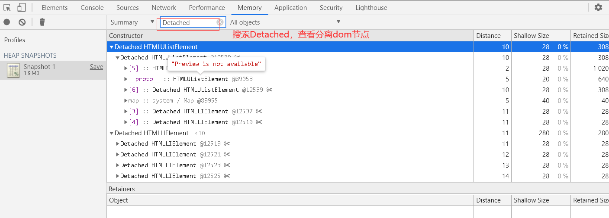

# 监控内存

## 内存问题的外在表现

- 页面出现延迟加载或经常性暂停: 可能存在频繁当 GC 操作,存在一些代码瞬间吃满了内存。
- 页面出现持续性的糟糕性能: 程序为了达到最优的运行速度，向内存申请了一片较大的内存空间，但空间大小超过了设备所能提供的大小。
- 页面使用随着时间延长越来越卡： 可能存在内存泄漏。

##界定内存问题的标准

- 内存泄漏：内存使用持续升高
- 内存膨胀：在多数设备上都存在性能问题
- 频繁垃圾回收：通过内存变化时序图进行分析

## 监控内存方式

### 任务管理器

这里以 Google 浏览器为例,使用 Shift + Esc 唤起 Google 浏览器自带的任务管理器

- Memory(内存) 列表示原生内存。DOM 节点存储在原生内存中。 如果此值正在增大，则说明正在创建 DOM 节点。
- JavaScript Memory（JavaScript 内存） 列表示 JS 堆。此列包含两个值。 您感兴趣的值是实时数字（括号中的数字）。 实时数字表示您的页面上的可到达对象正在使用的内存量。 如果此数字在增大，要么是正在创建新对象，要么是现有对象正在增长。

> 模拟内存泄漏

在任务管理器里可以看到 JavaScript 内存持续上升

```javascript
document.body.innerHTML = `<button id="add">add</button>`;
document.getElementById('add').addEventListener('click', function (e) {
  simulateMemoryLeak();
});
let result = [];
function simulateMemoryLeak() {
  setInterval(function () {
    result.push(new Array(1000000).join('x'));
    document.body.innerHTML = result;
  }, 100);
}
```

### Timeline 记录内存

这里以 Google 浏览器为例,使用 F12 开启调式，选择 Performance，点击 record（录制），进行页面操作，点击 stop 结束录制之后，开启内存勾选，拖动截图到指定时间段查看发生内存问题时候到页面展示，并定位问题。同时可以查看对应出现红点到执行脚本，定位问题代码。


### 利用浏览器内存模块，查找分离 dom

这里以 Google 浏览器为例,在页面上进行相关操作后，使用 F12 开启调式，选择 Memory，点击 Take snapshot（拍照），在快照中查找 Detached HTMLElement,回到代码中查找对应的分离 dom 存在的代码，在相关操作代码之后，对分离 dom 进行释放，防止内存泄漏。

只有页面的 DOM 树或 JavaScript 代码不再引用 DOM 节点时，DOM 节点才会被作为垃圾进行回收。 如果某个节点已从 DOM 树移除，但某些 JavaScript 仍然引用它，我们称此节点为“已分离”。已分离的 DOM 节点是内存泄漏的常见原因。

> 模拟已分离 DOM 节点

```javascript
document.body.innerHTML = `<button id="add">add</button>`;
document.getElementById('add').addEventListener('click', function (e) {
  create();
});
let detachedTree;
function create() {
  let ul = document.createElement('ul');
  for (let i = 0; i < 10; i++) {
    let li = document.createElement('li');
    ul.appendChild(li);
  }
  detachedTree = ul;
}
```



### 如何确定频繁对垃圾回收

- GC 工作时，程序是暂停的，频繁/过长的 GC 会导致程序假死，用户会感知到卡顿。
- 查看 Timeline 中是否存在内存走向在短时间内频繁上升下降的区域。浏览器任务管理器是否频繁的增加减少。
