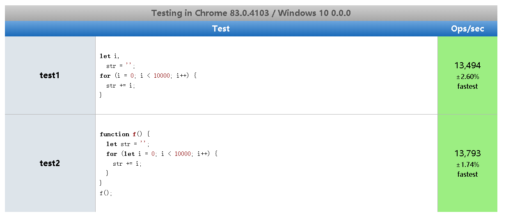
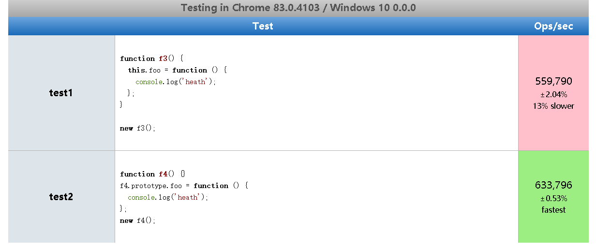
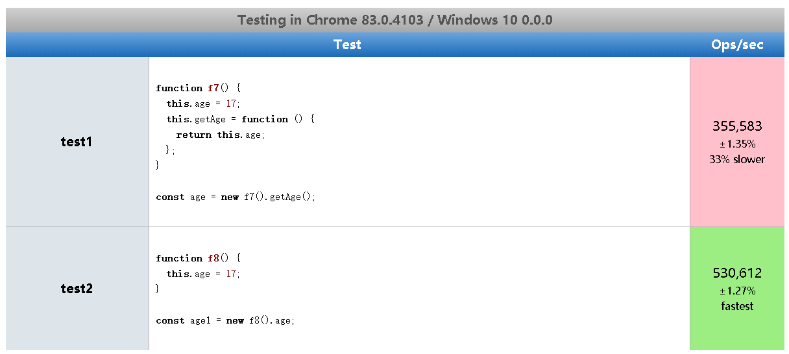
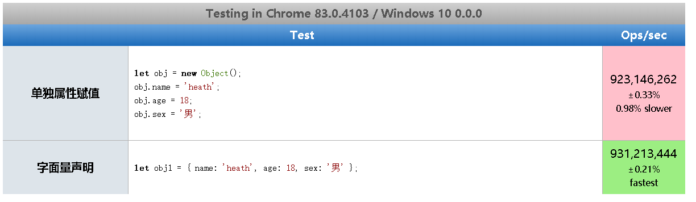

# 代码优化

## [jsPerf(JavaScript 性能测试)](https://jsperf.com/)

基于 Benchmark.js

## 慎用全局变量

- 全局变量定义在全局执行的上下文,是所有作用域链的顶端
- 全局执行上下文一直存在于上下文执行栈，直到程序退出
- 如果某个局部作用域出现了同名变量则会屏蔽或者污染全局作用域
- 全局变量的执行速度，访问速度要低于局部变量，因此对于一些需要经常访问的全局变量可以在局部作用域中进行缓存



上图可以看出，test2 的性能要比 test1 的性能要好，从而得知，全局变量的执行速度，访问速度要低于局部变量

## 避免全局查找


上图可以看出，test2 的性能要比 test1 的性能要好，从而得知，缓存全局变量后使用可以提升性能

## 通过原型对象添加附加方法提高性能



上图可以看出，test2 的性能要比 test1 的性能要好，从而得知，通过原型对象添加方法与直接在对象上添加成员方法相比，原型对象上的属性访问速度较快。

## 避开闭包陷阱

> 闭包特点

- 外部具有指向内部的引用
- 在“外”部作用域访问“内”部作用域的数据

```javascript
function foo() {
  let name = 'heath';
  function fn() {
    console.log(name);
  }
  return fn;
}
let a = foo();
a();
```

> 闭包使用不当很容易出现内存泄漏

```javascript
function f5() {
  // el 引用了全局变量document，假设btn节点被删除后，因为这里被引用着，所以这里不会被垃圾回收，导致内存泄漏
  let el = document.getElementById('btn');
  el.onclick = function (e) {
    console.log(e.id);
  };
}
f5();

function f6() {
  // el 引用了全局变量document，假设btn节点被删除后，因为这里被引用着，所以这里不会被垃圾回收，导致内存泄漏
  let el = document.getElementById('btn');
  el.onclick = function (e) {
    console.log(e.id);
  };
  el = null; // 我们这里手动将el内存释放，从而当btn节点被删除后，可以被垃圾回收
}
f6();
```

## 避免属性访问方法使用

> JavaScript 中的面向对象

- JS 不需属性的访问方法，所有属性都是外部可见的
- 使用属性访问方法只会增加一层重定义，没有访问的控制力



上图可以看出，test2 的性能要比 test1 的性能要好不少，从而得知，直接访问属性，会比通过方法访问属性速度来的快。

## 遍历速度


上图可以看出，loop 遍历速度 forEach > 优化 for > for of > for > for in

## dom 节点操作


上图可以看出，节点克隆(cloneNode)生成节点速度要快于创建节点。

## 采用字面量替换 New 操作



上图可以看出，字面量声明的数据生成速度要快于单独属性赋值行为生成的数据。
