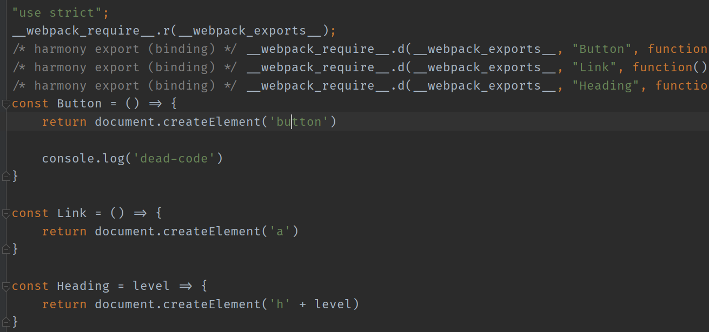
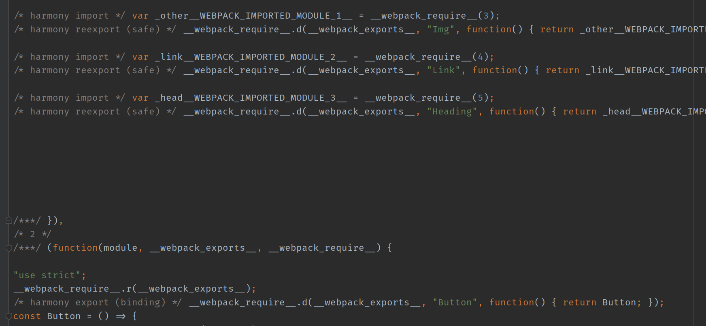
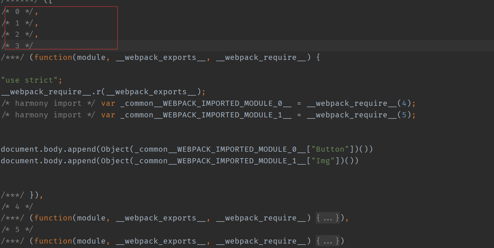
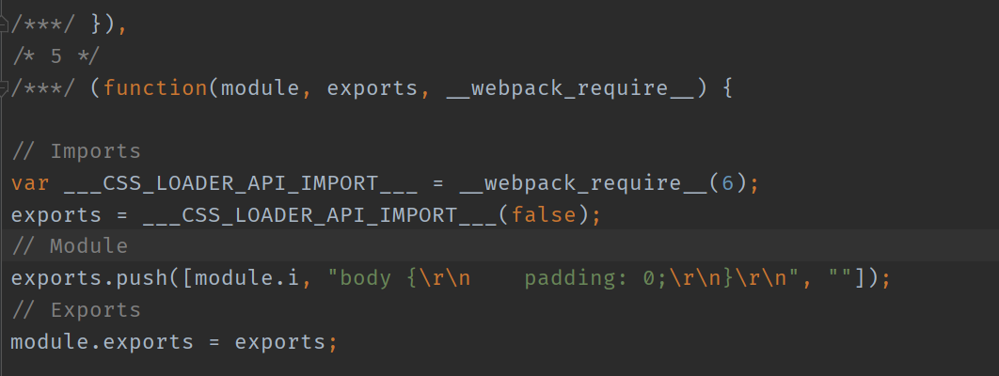

# Tree Shaking

Tree Shaking 是一个术语，通常用于描述移除 JavaScript 上下文中的未引用代码(dead-code)。它依赖于 ES2015 模块系统中的静态结构特性，例如 import 和 export。这个术语和概念实际上是兴起于 ES2015 模块打包工具 rollup。

你可以将未引用代码(dead-code)理解为枯树叶，使用 Tree Shaking 「摇掉」枯树叶

webpack 的 mode 为 production 时，会自动开启 Tree Shaking

## [optimization.usedExports](https://webpack.js.org/configuration/optimization/#optimizationusedexports)

`boolean = true`

负责标记「枯树叶」

## [optimization.minimizer](https://webpack.js.org/configuration/optimization/#optimizationminimizer)

负责「摇掉」它们

## 示例

### 不使用 Tree Shaking

`webpack.config.js`

```javascript
const path = require('path');
module.exports = {
  mode: 'none',
  entry: './src/main.js',
  output: {
    filename: 'bundle.js',
    path: path.join(__dirname, 'dist'),
  },
};
```

`src/common.js`

```javascript
export const Button = () => {
  return document.createElement('button');

  console.log('dead-code');
};

export const Link = () => {
  return document.createElement('a');
};

export const Heading = (level) => {
  return document.createElement('h' + level);
};
```

`src/main.js`

```javascript
import { Button } from './common';

document.body.append(Button());
```



从上图可以看出，webpack 会将那些未引用代码导出

### 使用 Tree Shaking

这里我们只配置 usedExports

`webpack.config.js`

```javascript
const path = require('path');
module.exports = {
  mode: 'none',
  entry: './src/main.js',
  output: {
    filename: 'bundle.js',
    path: path.join(__dirname, 'dist'),
  },
  optimization: {
    usedExports: true,
  },
};
```


从上图可以看出，webpack 会将那些未引用代码标记以及不导出，这里我们就可以使用 minimizer，开启 webpack 压缩优化，将其「摇掉」

`webpack.config.js`

```javascript
const path = require('path');
module.exports = {
  mode: 'none',
  entry: './src/main.js',
  output: {
    filename: 'bundle.js',
    path: path.join(__dirname, 'dist'),
  },
  optimization: {
    usedExports: true,
  },
};
```


从上图可以看出，webpack 会将那些未引用代码移除。

## Webpack Tree Shaking 与 Babel

在老版本的 Babel，使用`preset-env`，会将 ESModule 转换为 CommonJs，这将导致 Tree Shaking 失效；不过在新版本的 Babel 将 ESModule 转换为 CommonJs 功能关闭了。

## [optimization.concatenateModules](https://webpack.js.org/configuration/optimization/#optimizationconcatenatemodules) (合并模块)

`webpack.config.js`

```javascript
const path = require('path');
module.exports = {
  mode: 'none',
  entry: './src/main.js',
  output: {
    filename: 'bundle.js',
    path: path.join(__dirname, 'dist'),
  },
  optimization: {
    usedExports: true,
    concatenateModules: true,
  },
};
```

`src/main.js`

```javascript
import { Button } from './common';
import { Img } from './other';

document.body.append(Button());
document.body.append(Img());
```


从上图可以看出，webpack 会将多个模块合并到一个函数里

更多构建优化可以查看[optimization](https://webpack.js.org/configuration/optimization/)

## sideEffects

sideEffects 将文件标记为有无副作用

通常我们用于 NPM 包的开发

### 案例

`src/common/button.js`

```javascript
export const Button = () => {
  return document.createElement('button');

  console.log('dead-code');
};
```

`src/common/head.js`

```javascript
export const Heading = (level) => {
  return document.createElement('h' + level);
};
```

`src/common/link.js`

```javascript
export const Link = () => {
  return document.createElement('a');
};
```

`src/common/other.js`

```javascript
export const Img = () => {
  return document.createElement('img');
};
```

`src/common/index.js`

```javascript
export { Button } from './button';
export { Img } from './other';
export { Link } from './link';
export { Heading } from './head';
```

`src/main.js`

```javascript
import { Button, Img } from './common';

document.body.append(Button());
document.body.append(Img());
```

不开启`sideEffects`

`webpack.config.js`

```javascript
const path = require('path');
module.exports = {
  mode: 'none',
  entry: './src/main.js',
  output: {
    filename: 'bundle.js',
    path: path.join(__dirname, 'dist'),
  },
  optimization: {},
};
```



从上图可以看出，webpack 会将那些所有的模块都导出

开启`sideEffects`

`webpack.config.js`

```javascript
const path = require('path');
module.exports = {
  mode: 'none',
  entry: './src/main.js',
  output: {
    filename: 'bundle.js',
    path: path.join(__dirname, 'dist'),
  },
  optimization: {
    sideEffects: true,
  },
};
```

将项目代码标记为无副作用

`package.json`

```json
{
  "name": "tree-shaking",
  "version": "1.0.0",
  "main": "index.js",
  "license": "MIT",
  "devDependencies": {
    "webpack": "^4.44.0",
    "webpack-cli": "^3.3.12"
  },
  "sideEffects": false
}
```



从上图可以看出，webpack 会将那些未使用代码移除

## sideEffects 注意点

任何导入的文件和原型链都会受到 tree shaking 的影响。这意味着，如果在项目中使用类似 css-loader 并导入 CSS 文件，则需要将其添加到 side effect 列表中，以免在生产模式中无意中将它删除

### 案例

`src/extend.js`

```javascript
// 副作用代码
// 为 Number 的原型添加一个扩展方法
Number.prototype.pad = function (size) {
  // 将数字转为字符串 => '8'
  let result = this + '';
  // 在数字前补指定个数的 0 => '008'
  while (result.length < size) {
    result = '0' + result;
  }
  return result;
};
```

副作用代码

`src/style.css`

```css
body {
  padding: 0;
}
```

`src/main.js`

```javascript
import { Button, Img } from './common';
import './extend';
import './style.css';

document.body.append(Button());
document.body.append(Img());
console.log((1).pad(2));
```


从上图可以看出，webpack 将 style.css 和 extend.js 也移除了

### 解决

`package.json`

```json
{
  "name": "tree-shaking",
  "version": "1.0.0",
  "main": "index.js",
  "license": "MIT",
  "devDependencies": {
    "css-loader": "^3.6.0",
    "webpack": "^4.44.0",
    "webpack-cli": "^3.3.12"
  },
  "sideEffects": ["./src/extent.js", "*.css"]
}
```



从上图可以看出，webpack 不会将 style.css 和 extend.js 移除了
