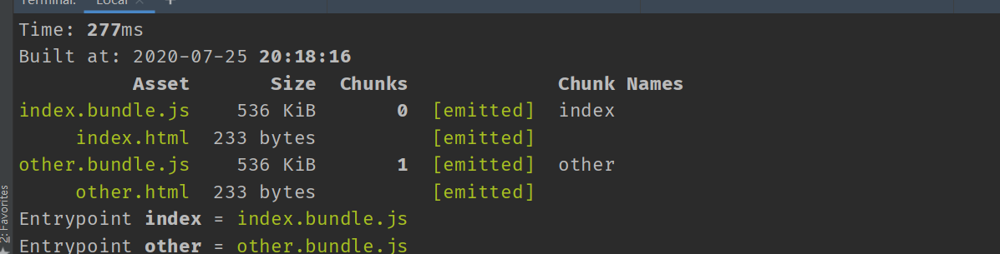
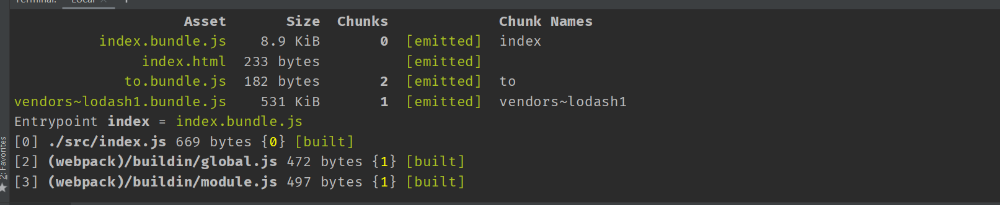

# 代码分离

代码分离是 webpack 中最引人注目的特性之一。此特性能够把代码分离到不同的 bundle 中，然后可以按需加载或并行加载这些文件。代码分离可以用于获取更小的 bundle，以及控制资源加载优先级，如果使用合理，会极大影响加载时间。

有三种常用的代码分离方法：

- 入口起点：使用 entry 配置手动地分离代码。
- 防止重复：使用 SplitChunksPlugin 去重和分离 chunk。
- 动态导入：通过模块的内联函数调用来分离代码。

## 入口起点(entry points)

这是迄今为止最简单、最直观的分离代码的方式。不过，这种方式手动配置较多，并有一些陷阱，我们将会解决这些问题。先来看看如何从 main bundle 中分离另一个模块：

`src/index.js`

```javascript
import _ from 'lodash';
import to from './to';

const aEl = document.createElement('a');
aEl.href = _.last(to);
aEl.text = _.last(to);
document.body.append(aEl);
```

`src/other.js`

```javascript
import _ from 'lodash';
import to from './to';

const aEl = document.createElement('a');
aEl.href = _.first(to);
aEl.text = _.first(to);
document.body.append(aEl);
```

`src/to.js`

```javascript
module.exports = ['index.html', 'other.html'];
```

`webpack.config.js`

```javascript
const path = require('path');
const HTMLWebpackPlugin = require('html-webpack-plugin');
const { CleanWebpackPlugin } = require('clean-webpack-plugin');

module.exports = {
  mode: 'none',
  entry: {
    index: './src/index.js',
    other: './src/other.js',
  },
  output: {
    filename: '[name].bundle.js',
    path: path.resolve(__dirname, 'dist'),
  },
  plugins: [
    new CleanWebpackPlugin(),
    new HTMLWebpackPlugin({
      filename: 'index.html',
      chunks: ['index'],
    }),
    new HTMLWebpackPlugin({
      filename: 'other.html',
      chunks: ['other'],
    }),
  ],
};
```

构建生成文件



正如前面提到的，这种方法存在一些问题:

- 如果入口 chunks 之间包含重复的模块，那些重复模块都会被引入到各个 bundle 中。
- 这种方法不够灵活，并且不能将核心应用程序逻辑进行动态拆分代码。

以上两点中，第一点对我们的示例来说无疑是个问题，因为我们在 `./src/index.js`和`./src/other.js` 中都引入过`lodash`和`to.js`，这样就在两个 bundle 中造成重复引用。接着，我们通过使用 [SplitChunksPlugin](https://webpack.js.org/plugins/split-chunks-plugin/) 来移除重复的模块。

## 防止重复(Prevent Duplication)

SplitChunksPlugin 可以将公共的依赖模块提取到已有的入口 chunk 中，或者提取到一个新生成的 chunk。让我们使用这个插件，将之前的示例中重复的`lodash`和`to.js`模块去除：

`webpack.config.js`

```javascript
const path = require('path');
const HTMLWebpackPlugin = require('html-webpack-plugin');
const webpack = require('webpack');
const { CleanWebpackPlugin } = require('clean-webpack-plugin');

module.exports = {
  mode: 'none',
  entry: {
    index: './src/index.js',
    other: './src/other.js',
  },
  output: {
    filename: '[name].bundle.js',
    path: path.resolve(__dirname, 'dist'),
  },
  optimization: {
    splitChunks: { chunks: 'all' },
  },
  plugins: [
    new CleanWebpackPlugin(),
    new HTMLWebpackPlugin({
      filename: 'index.html',
      chunks: ['index'],
    }),
    new HTMLWebpackPlugin({
      filename: 'other.html',
      chunks: ['other'],
    }),
  ],
};
```

构建生成文件


从上图可以看出，webpack 将公共部分抽取到一个单独的 js 文件里

## [动态导入(Dynamic Imports)](https://webpack.js.org/guides/code-splitting/#dynamic-imports)

当涉及到动态代码拆分时，webpack 提供了两个类似的技术。对于动态导入，第一种，也是优先选择的方式是，使用符合 ECMAScript 提案 的 import() 语法。第二种，则是使用 webpack 特定的 require.ensure。

> import() 调用会在内部用到 promises。如果在旧有版本浏览器中使用 import()，记得使用 一个 polyfill 库（例如 es6-promise 或 promise-polyfill），来 shim Promise。

现在，我们不再使用静态导入`lodash`和`to.js`，而是通过使用动态导入来分离一个 chunk：

`src/index.js`

```javascript
const render = () => {
  import(/* webpackChunkName: "lodash" */ 'lodash').then((_) => {
    import(/* webpackChunkName: "to" */ './to.js').then(({ default: to }) => {
      const hash = window.location.hash || _.first(to);
      const aEl = document.createElement('a');
      if (hash === _.first(to)) {
        aEl.href = _.last(to);
        aEl.text = _.last(to);
      } else {
        aEl.href = _.first(to);
        aEl.text = _.first(to);
      }
      document.body.innerHTML = '';
      document.body.append(aEl);
    });
  });
};
render();
window.addEventListener('hashchange', render);
```

> 在注释中使用了 webpackChunkName。这样做会导致我们的 bundle 被命名为 `to.bundle.js` ，而不是 `[id].bundle.js` 。使用同名会将其打包到同一个 js 文件下

`src/to.js`

```javascript
module.exports = ['#index', '#other'];
```

`webpack.config.js`

```javascript
const path = require('path');
const HTMLWebpackPlugin = require('html-webpack-plugin');
const { CleanWebpackPlugin } = require('clean-webpack-plugin');

module.exports = {
  mode: 'none',
  entry: {
    index: './src/index.js',
  },
  output: {
    filename: '[name].bundle.js',
    chunkFilename: '[name].bundle.js',
    path: path.resolve(__dirname, 'dist'),
  },
  plugins: [new CleanWebpackPlugin(), new HTMLWebpackPlugin()],
};
```

构建生成文件



从上图可以看出，webpack 将动态导入文件抽取到一个单独的 js 文件里
