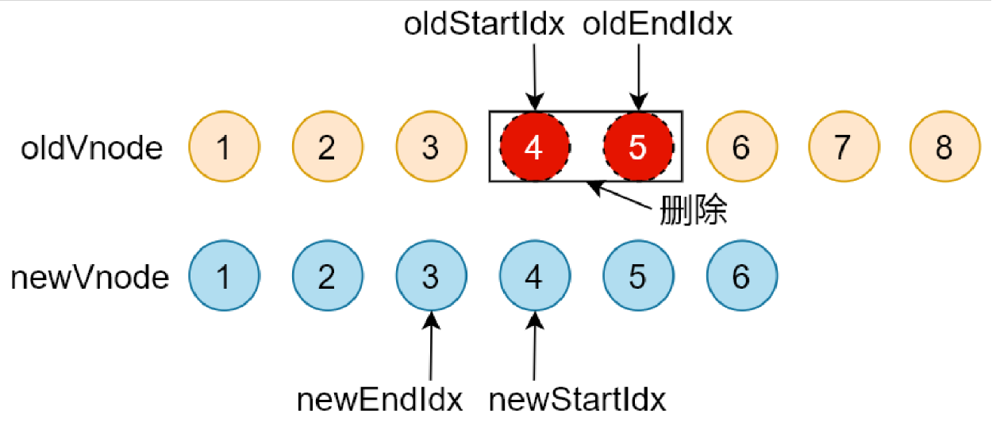

# 手写 Vue Router、手写响应式实现、虚拟 DOM 和 Diff 算法

- [Vue Router](w-001-vue-router)

## 题目

### 简答题

1、当我们点击按钮的时候动态给 data 增加的成员是否是响应式数据，如果不是的话，如果把新增成员设置成响应式数据，它的内部原理是什么。

```javascript
let vm = new Vue({
 el: '#el'
 data: {
  o: 'object',
  dog: {}
 },
 method: {
  clickHandler () {
   // 该 name 属性是否是响应式的
   this.dog.name = 'Trump'
  }
 }
})
```

2、请简述 Diff 算法的执行过程


- 循环结束
  - 当老节点的所有子节点先遍历完 (oldStartIdx > oldEndIdx)，循环结束
  - 新节点的所有子节点先遍历完 (newStartIdx > newEndIdx)，循环结束
- 如果老节点的数组先遍历完(oldStartIdx > oldEndIdx)，说明新节点有剩余，把剩余节点批量插入到右边


- 如果新节点的数组先遍历完(newStartIdx > newEndIdx)，说明老节点有剩余，把剩余节点批量删除


