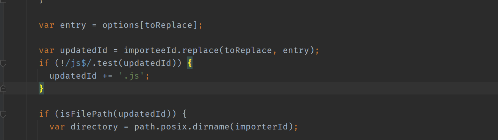

# Vue.js 源码分析（响应式、虚拟 DOM、模板编译和组件化）

## window 下解决 vue 源码编译报错问题


在`node_modules\rollup-plugin-alias\dist\rollup-plugin-alias.js`中添加下面的代码



```javascript
if (!/js$/.test(updatedId)) {
  updatedId += '.js';
}
```

## 源码目录结构

```
src
├─compiler 编译相关
├─core Vue 核心库
├─platforms 平台相关代码
├─server SSR，服务端渲染
├─sfc .vue 文件编译为 js 对象
└─shared 公共的代码
```

## 源码 vue 打包工具

- Vue.js 源码的打包工具使用的是 Rollup，比 Webpack 轻量
- Webpack 把所有文件当做模块，Rollup 只处理 js 文件更适合在 Vue.js 这样的库中使用
- Rollup 打包不会生成冗余的代码

## Vue 的不同构建版本

|                           | UMD                | CommonJS              | ES Module (基于构建工具使用) | ES Module (直接用于浏览器) |
| ------------------------- | ------------------ | --------------------- | ---------------------------- | -------------------------- |
| 完整版                    | vue.js             | vue.common.js         | vue.esm.js                   | vue.esm.browser.js         |
| 只包含运行时版            | vue.runtime.js     | vue.runtime.common.js | vue.runtime.esm.js           | -                          |
| 完整版 (生产环境)         | vue.min.js         | -                     | -                            | vue.esm.browser.min.js     |
| 只包含运行时版 (生产环境) | vue.runtime.min.js | -                     | -                            | -                          |

详情请前往[官方文档](https://cn.vuejs.org/v2/guide/installation.html#%E5%AF%B9%E4%B8%8D%E5%90%8C%E6%9E%84%E5%BB%BA%E7%89%88%E6%9C%AC%E7%9A%84%E8%A7%A3%E9%87%8A) 查看

- 推荐使用运行时版本，因为运行时版本相比完整版体积要小大约 30%
- 基于 Vue-CLI 创建的项目默认使用的是 vue.runtime.esm.js
  - 通过查看 webpack 的配置文件

```
vue inspect > output.js
```

> 注意： \*.vue 文件中的模板是在构建时预编译的，最终打包后的结果不需要编译器，只需要运行时版本即可

## 寻找入口文件

在解析源码时，将使用完整版

截取 [package.json](https://gitee.com/Wuner/vue-resovle/blob/master/package.json) 部分代码

-c 后面跟着的是配置文件，接下来分析`build/config.js`

```json
{
  "scripts": {
    "dev": "rollup -w -c build/config.js --soucemap --environment TARGET:web-full-dev"
  }
}
```

### 解析 [build/config.js](https://gitee.com/Wuner/vue-resovle/blob/master/build/config.js)

作用：根据 TARGET 变量生成 rollup 构建的配置文件

```javascript
// 判断环境变量是否有 TARGET
// 如果有的话 使用 genConfig() 生成 rollup 配置文件
if (process.env.TARGET) {
  module.exports = genConfig(process.env.TARGET);
} else {
  // 否则获取全部配置
  exports.getBuild = genConfig;
  exports.getAllBuilds = () => Object.keys(builds).map(genConfig);
}
```

解析`genConfig(name)`方法

```javascript
function genConfig (name) {
  // 根据环境变量 TARGET(name) 获取配置信息
  // 获取生成配置的信息
  const opts = builds[name]
  const config = {..}

  if (opts.env) {...}

  Object.defineProperty(config, '_name', {...})

  return config
}
```

截取部分代码，解析`builds`对象

```javascript
// 获取入口和出口文件的绝对路径
const builds = {
  'web-full-dev': {
    entry: resolve('web/entry-runtime-with-compiler.js'),
    dest: resolve('dist/vue.js'),
    format: 'umd',
    env: 'development',
    alias: { he: './entity-decoder' },
    banner,
  },
};
```

解析`resolve`方法

```javascript
// 根据别名从别名列表中取对应的输入文件绝对路径
const aliases = require('./alias');

// 将文件路径转换为绝对路径
const resolve = (p) => {
  const base = p.split('/')[0];
  if (aliases[base]) {
    return path.resolve(aliases[base], p.slice(base.length + 1));
  } else {
    return path.resolve(__dirname, '../', p);
  }
};
```

[alias.js](https://gitee.com/Wuner/vue-resovle/blob/master/build/alias.js)

```javascript
const path = require('path');

const resolve = (p) => path.resolve(__dirname, '../', p);

module.exports = {
  vue: resolve('src/platforms/web/entry-runtime-with-compiler'),
  compiler: resolve('src/compiler'),
  core: resolve('src/core'),
  shared: resolve('src/shared'),
  web: resolve('src/platforms/web'),
  weex: resolve('src/platforms/weex'),
  server: resolve('src/server'),
  entries: resolve('src/entries'),
  sfc: resolve('src/sfc'),
};
```

### 总结

- 把`src/platforms/web/entry-runtime-with-compiler.js`构建成`dist/vue.js`，如果设置`--sourcemap`会生成`vue.js.map`
- `src/platform`文件夹下是`Vue`可以构建成不同平台下使用的库，目前有`weex`和`web`，还有服务器端渲染的库

## 如果同时设置 template 和 render 此时会渲染什么？

```javascript
const vm = new Vue({
  el: '#app',
  template: '<h3>Hello template</h3>',
  render(h) {
    return h('h4', 'Hello render');
  },
});
```

- el 不能是 body 或者 html 标签
- 如果没有 render，把 template 转换成 render 函数
- 如果有 render 方法，直接调用 mount 挂载 DOM

[src/platforms/web/entry-runtime-with-compiler.js](https://gitee.com/Wuner/vue-resovle/blob/master/src/platforms/web/entry-runtime-with-compiler.js)

```javascript
// 如果el是body或者html，在非生产环境将抛出警告
if (el === document.body || el === document.documentElement) {...}

const options = this.$options;
// resolve template/el and convert to render function
// 如果不存在render属性，将获取template转换为render
if (!options.render) {...}
// 调用mount方法，挂载DOM
return mount.call(this, el, hydrating);
```

## Vue 的构造函数在哪里

上面我们已得知入口文件

[src/platforms/web/entry-runtime-with-compiler.js](https://gitee.com/Wuner/vue-resovle/blob/master/src/platforms/web/entry-runtime-with-compiler.js)

```javascript
import Vue from './runtime/index';
```

这里导入了 Vue，继续往下查看

[src/platforms/web/runtime/index.js](https://gitee.com/Wuner/vue-resovle/blob/master/src/platforms/web/runtime/index.js)

```javascript
/* @flow */

import Vue from 'core/index'
import ...

// install platform specific utils
// 安装特定于平台的工具
// 判断是否是关键属性(表单元素的 input/checked/selected/muted)
// 如果是这些属性，设置el.props属性(属性不设置到标签上)
Vue.config.mustUseProp = mustUseProp
// 判断是否是html标签，或者是否是svg
Vue.config.isReservedTag = isReservedTag
Vue.config.isReservedAttr = isReservedAttr
Vue.config.getTagNamespace = getTagNamespace
Vue.config.isUnknownElement = isUnknownElement

// install platform runtime directives & components
// 安装平台运行时指令和组件
// 指令 v-model、v-show
extend(Vue.options.directives, platformDirectives)
// 组件 transition、transition-group
extend(Vue.options.components, platformComponents)

// install platform patch function
// __patch__方法将虚拟dom转换为真实dom
Vue.prototype.__patch__ = inBrowser ? patch : noop

// public mount method
// 设置 $mount 方法，挂载 DOM
Vue.prototype.$mount = function (
  el?: string | Element,
  hydrating?: boolean
): Component {
  el = el && inBrowser ? query(el) : undefined
  return mountComponent(this, el, hydrating)
}

// devtools global hook
/* istanbul ignore next */
Vue.nextTick(() => {...}, 0)

export default Vue
```

这里导入了 Vue，继续往下查看

[src/core/index.js](https://gitee.com/Wuner/vue-resovle/blob/master/src/core/index.js)

```javascript
import Vue from './instance/index';
```

这里导入了 Vue，继续往下查看

[src/core/instance/index.js](https://gitee.com/Wuner/vue-resovle/blob/master/src/core/instance/index.js)

```javascript
import ...

// Vue构造函数
function Vue(options) {
  if (process.env.NODE_ENV !== 'production' && !(this instanceof Vue)) {
    warn('Vue is a constructor and should be called with the `new` keyword');
  }
  // 调用_init方法
  this._init(options);
}

// 注册 vm 的 _init() 方法，初始化 vm
initMixin(Vue);
// 注册 vm 的 $data/$props/$set/$delete/$watch
stateMixin(Vue);
// 初始化事件相关方法
// $on/$once/$off/$emit
eventsMixin(Vue);
// 初始化生命周期相关的混入方法
// _update/$forceUpdate/$destroy
lifecycleMixin(Vue);
// 混入 render
// $nextTick/_render
renderMixin(Vue);

export default Vue;
```

### 总结

- `src/platforms/web/entry-runtime-with-compiler.js`
  - web 平台相关的入口
  - 重写了平台相关的 \$mount() 方法
  - 注册了 Vue.compile() 方法，传递一个 HTML 字符串返回 render 函数
- `src/platforms/web/runtime/index.js`
  - web 平台相关
  - 注册和平台相关的全局指令：v-model、v-show
  - 注册和平台相关的全局组件： v-transition、v-transition-group
  - 全局方法：
    - **patch**：把虚拟 DOM 转换成真实 DOM
    - \$mount：挂载方法
- `src/core/index.js`
  - 与平台无关
  - 设置了 Vue 的静态方法，initGlobalAPI(Vue)
- `src/core/instance/index.js`
  - 与平台无关
  - 定义了构造函数，调用了 this.\_init(options) 方法
  - 给 Vue 中混入了常用的实例成员

## Vue 初始化

[src/core/instance/index.js](https://gitee.com/Wuner/vue-resovle/blob/master/src/core/instance/index.js)

- 定义 Vue 的构造函数
- 初始化 Vue 的实例成员

```javascript
import ...

// Vue构造函数
function Vue(options) {
  if (process.env.NODE_ENV !== 'production' && !(this instanceof Vue)) {
    warn('Vue is a constructor and should be called with the `new` keyword');
  }
  // 调用_init方法
  this._init(options);
}

// 注册 vm 的 _init() 方法，初始化 vm
initMixin(Vue);
// 注册 vm 的 $data/$props/$set/$delete/$watch
stateMixin(Vue);
// 初始化事件相关方法
// $on/$once/$off/$emit
eventsMixin(Vue);
// 初始化生命周期相关的混入方法
// _update/$forceUpdate/$destroy
lifecycleMixin(Vue);
// 混入 render
// $nextTick/_render
renderMixin(Vue);

export default Vue;
```

[initMixin()](https://gitee.com/Wuner/vue-resovle/blob/master/src/core/instance/init.js)

```javascript
/* @flow */

import ...

let uid = 0

export function initMixin (Vue: Class<Component>) {
  // 在vue原型上挂载_init方法
  // 合并 options / 初始化操作
  Vue.prototype._init = function (options?: Object) {
    const vm: Component = this
    // a uid
    vm._uid = uid++

    let startTag, endTag
    /* istanbul ignore if */
    if (process.env.NODE_ENV !== 'production' && config.performance && mark) {
      startTag = `vue-perf-start:${vm._uid}`
      endTag = `vue-perf-end:${vm._uid}`
      mark(startTag)
    }

    // a flag to avoid this being observed
    // 如果是vue实例对象，则无需被observe
    vm._isVue = true
    // merge options
    // 合并options
    // 如果存在_isComponent，则优化内部组件实例。
    // 因为动态选项合并非常慢，而且内部组件选项都不需要特殊处理。
    if (options && options._isComponent) {
      // optimize internal component instantiation
      // since dynamic options merging is pretty slow, and none of the
      // internal component options needs special treatment.
      initInternalComponent(vm, options)
    } else {
      vm.$options = mergeOptions(
        resolveConstructorOptions(vm.constructor),
        options || {},
        vm
      )
    }
    /* istanbul ignore else */
    // 初始化代理
    if (process.env.NODE_ENV !== 'production') {
      initProxy(vm)
    } else {
      vm._renderProxy = vm
    }
    // expose real self
    vm._self = vm
    // vm 的生命周期相关变量初始化
    // $children/$parent/$root/$refs
    initLifecycle(vm)
    // vm 的事件监听初始化, 父组件绑定在当前组件上的事件
    initEvents(vm)
    // vm 的编译render初始化
    // $slots/$scopedSlots/_c/$createElement/$attrs/$listeners
    initRender(vm)
    // 执行beforeCreate 生命钩子的回调
    callHook(vm, 'beforeCreate')
    // 在data/props之前把 inject 的成员注入到 vm 上
    initInjections(vm) // resolve injections before data/props
    // 初始化状态 vm 的 _props/methods/_data/computed/watch
    initState(vm)
    // 在data/props之后初始化 provide
    initProvide(vm) // resolve provide after data/props
    // 执行created 生命钩子的回调
    callHook(vm, 'created')

    /* istanbul ignore if */
    if (process.env.NODE_ENV !== 'production' && config.performance && mark) {
      vm._name = formatComponentName(vm, false)
      mark(endTag)
      measure(`vue ${vm._name} init`, startTag, endTag)
    }

    // 如果没有提供 el，调用 $mount() 挂载
    if (vm.$options.el) {
      vm.$mount(vm.$options.el)
    }
  }
}

function initInternalComponent (vm: Component, options: InternalComponentOptions) {...}

export function resolveConstructorOptions (Ctor: Class<Component>) {...}

function resolveModifiedOptions (Ctor: Class<Component>): ?Object {...}

function dedupe (latest, extended, sealed) {...}

```

[src/core/global-api/index.js](https://gitee.com/Wuner/vue-resovle/blob/master/src/core/global-api/index.js)

- 初始化 Vue 的静态方法

```javascript
/* @flow */

import ...

import {
  warn,
  extend,
  nextTick,
  mergeOptions,
  defineReactive,
} from '../util/index';

// 注册vue的静态属性/方法
export function initGlobalAPI(Vue: GlobalAPI) {
  // config
  const configDef = {};
  configDef.get = () => config;
  if (process.env.NODE_ENV !== 'production') {
    configDef.set = () => {
      warn(
        'Do not replace the Vue.config object, set individual fields instead.',
      );
    };
  }
  // 初始化 Vue.config 对象
  Object.defineProperty(Vue, 'config', configDef);

  // exposed util methods.
  // NOTE: these are not considered part of the public API - avoid relying on
  // them unless you are aware of the risk.
  // 注意：这些不被认为是公共API的一部分-除非您意识到风险，否则请不要依赖它们。
  Vue.util = {
    warn,
    extend,
    mergeOptions,
    defineReactive,
  };

  // 静态方法set/del/nextTick
  Vue.set = set;
  Vue.delete = del;
  Vue.nextTick = nextTick;

  // 初始化Vue.options对象，并对其扩展
  Vue.options = Object.create(null);
  // 遍历ASSET_TYPES取到component/directive/filter，添加到options中，并初始化为空对象
  ASSET_TYPES.forEach((type) => {
    Vue.options[type + 's'] = Object.create(null);
  });

  // this is used to identify the "base" constructor to extend all plain-object
  // components with in Weex's multi-instance scenarios.
  // 在Weex的多实例场景中，它用于标识“基本”构造函数以扩展所有纯对象组件。
  Vue.options._base = Vue;
  // 设置 keep-alive 组件
  extend(Vue.options.components, builtInComponents);

  // 注册 Vue.use() 用来注册插件
  initUse(Vue);
  // 注册 Vue.mixin() 实现混入
  initMixin(Vue);
  // 注册 Vue.extend() 基于传入的options返回一个组件的构造函数
  initExtend(Vue);
  // 注册 Vue.directive()、 Vue.component()、Vue.filter()
  initAssetRegisters(Vue);
}
```

## 首次渲染过程

- Vue 初始化完毕，开始真正的执行
- 调用 new Vue() 之前，已经初始化完毕
- 通过调试代码，记录首次渲染过程


