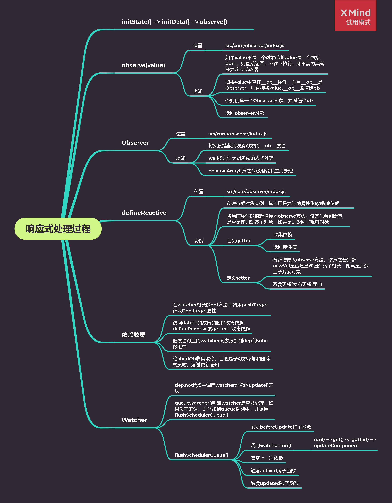

# Vue.js 源码剖析-响应式原理

## 响应式处理的入口

- [src/core/instance/init.js](https://gitee.com/Wuner/vue-resovle/blob/master/src/core/instance/init.js)
  - initState(vm) vm 状态的初始化
  - 初始化了 \_data、\_props、methods 等
- [src/core/instance/state.js](https://gitee.com/Wuner/vue-resovle/blob/master/src/core/instance/state.js)

```javascript
/* @flow */

import ...;

const sharedPropertyDefinition = {...};

export function proxy(target: Object, sourceKey: string, key: string) {...}

export function initState(vm: Component) {
  vm._watchers = [];
  const opts = vm.$options;
  if (opts.props) initProps(vm, opts.props);
  if (opts.methods) initMethods(vm, opts.methods);
  // 判断options中是否存在data属性
  if (opts.data) {
    // 如果存在data属性，则给其添加响应式
    initData(vm);
  } else {
    // 如果不存在data属性，则给给vue对象，添加_data属性，初始化为空对象，并给其添加响应式
    observe((vm._data = {}), true /* asRootData */);
  }
  if (opts.computed) initComputed(vm, opts.computed);
  if (opts.watch && opts.watch !== nativeWatch) {
    initWatch(vm, opts.watch);
  }
}

function initProps(vm: Component, propsOptions: Object) {...}

function initData(vm: Component) {
  let data = vm.$options.data;
  // 判断data是否是函数，如果是一个函数，则是组件中的data，将其this指向vue
  // 不是函数，则判断是否存在。不存在则赋值为空对象
  data = vm._data = typeof data === 'function' ? getData(data, vm) : data || {};
  // 判断data是否是[object Object]，如果不是，则将data赋值为空对象
  // 并在非production环境下，抛出警告
  if (!isPlainObject(data)) {
    data = {};
    process.env.NODE_ENV !== 'production' &&
      warn(
        'data functions should return an object:\n' +
          'https://vuejs.org/v2/guide/components.html#data-Must-Be-a-Function',
        vm,
      );
  }
  // proxy data on instance
  // 获取data的所有key值
  const keys = Object.keys(data);
  const props = vm.$options.props;
  const methods = vm.$options.methods;
  let i = keys.length;
  while (i--) {
    const key = keys[i];
    // 在非production环境下，判断是否与methods里的方法存在同名，存在则抛出警告
    if (process.env.NODE_ENV !== 'production') {
      if (methods && hasOwn(methods, key)) {
        warn(
          `Method "${key}" has already been defined as a data property.`,
          vm,
        );
      }
    }
    // 在非production环境下，判断是否与props里的属性存在同名，存在则抛出警告
    if (props && hasOwn(props, key)) {
      process.env.NODE_ENV !== 'production' &&
        warn(
          `The data property "${key}" is already declared as a prop. ` +
            `Use prop default value instead.`,
          vm,
        );
    } else if (!isReserved(key)) {
      // 如果key的第一个字符不是$或者_，为其设置代理
      proxy(vm, `_data`, key);
    }
  }
  // observe data
  // 将data转换为响应式数据
  // true：告诉observe函数，其为根属性data
  observe(data, true /* asRootData */);
}

function getData(data: Function, vm: Component): any {...}

const computedWatcherOptions = { lazy: true };

function initComputed(vm: Component, computed: Object) {...}

export function defineComputed(
  target: any,
  key: string,
  userDef: Object | Function,
) {...}

function createComputedGetter(key) {...}

function initMethods(vm: Component, methods: Object) {...}

function initWatch(vm: Component, watch: Object) {...}

function createWatcher(
  vm: Component,
  keyOrFn: string | Function,
  handler: any,
  options?: Object,
) {...}

export function stateMixin(Vue: Class<Component>) {...}
```

[src/core/observer/index.js](https://gitee.com/Wuner/vue-resovle/blob/master/src/core/observer/index.js)

- observe(value, asRootData)
- 负责为每一个 Object 类型的 value 创建一个 observer 实例

```javascript
/* @flow */

import ...;

const arrayKeys = Object.getOwnPropertyNames(arrayMethods);
export const observerState = {
  shouldConvert: true,
};
export class Observer {...}

function protoAugment(target, src: Object, keys: any) {...}

/* istanbul ignore next */
function copyAugment(target: Object, src: Object, keys: Array<string>) {...}

/**
 * Attempt to create an observer instance for a value,
 * returns the new observer if successfully observed,
 * or the existing observer if the value already has one.
 */
// 如果不存在观察者实例，则创建观察者实例，并返回
// 存在，则直接返回现有的观察者实例
export function observe(value: any, asRootData: ?boolean): Observer | void {
  // 如果value不是一个对象或者value是一个虚拟dom，则不往下执行，即不需为其转换为响应式数据
  if (!isObject(value) || value instanceof VNode) {
    return;
  }
  let ob: Observer | void;
  // 如果value中存在__ob__属性，并且__ob__是Observer，则直接将value.__ob__赋值给ob
  if (hasOwn(value, '__ob__') && value.__ob__ instanceof Observer) {
    ob = value.__ob__;
  } else if (
    observerState.shouldConvert &&
    !isServerRendering() &&
    (Array.isArray(value) || isPlainObject(value)) &&
    Object.isExtensible(value) &&
    !value._isVue
  ) {
    // observerState.shouldConvert为true
    // 并且当前是浏览器环境
    // 并且value是一个数组或者是'[object Object]'
    // 并且value是可扩展的（可以在它上面添加新的属性）
    // 并且value不是Vue实例
    // 创建一个Observer对象，并赋值给ob
    ob = new Observer(value);
  }
  // 如果处理的是根数据并且存在ob，则ob.vmCount++
  if (asRootData && ob) {
    ob.vmCount++;
  }
  return ob;
}
export function defineReactive(
  obj: Object,
  key: string,
  val: any,
  customSetter?: ?Function,
  shallow?: boolean,
) {...}

export function set(target: Array<any> | Object, key: any, val: any): any {...}
export function del(target: Array<any> | Object, key: any) {...}
function dependArray(value: Array<any>) {...}
```

## Observer

[src/core/observer/index.js](https://gitee.com/Wuner/vue-resovle/blob/master/src/core/observer/index.js)

- Observer 类
  - constructor()方法，初始化数据，并改变数组当前对象的原型属性
  - walk()方法为对象做响应式处理
  - observeArray()方法为数组做响应式处理

```javascript
export class Observer {
  // 数据对象
  value: any;
  // 依赖对象
  dep: Dep;
  // 实例计数器
  // 以该对象在根$data的vms数
  vmCount: number; // number of vms that has this object as root $data

  // 构造函数，初始化数据
  constructor(value: any) {
    this.value = value;
    this.dep = new Dep();
    this.vmCount = 0;
    // 将实例挂载到观察对象的__ob__属性
    def(value, '__ob__', this);
    // 如果观察对象是一个数组，将数组转换为响应式数据
    if (Array.isArray(value)) {
      const augment = hasProto
        ? protoAugment // 改变数组当前对象的原型属性
        : copyAugment; // 改变数组当前对象的原型属性
      // arrayKeys是对象的所有自身属性的属性名组成的数组
      augment(value, arrayMethods, arrayKeys);
      // 为数组中的每一个对象元素创建一个observer实例
      this.observeArray(value);
    } else {
      // 遍历对象中的每一个属性，转换成getter/setter
      this.walk(value);
    }
  }

  /**
   * Walk through each property and convert them into
   * getter/setters. This method should only be called when
   * value type is Object.
   */
  walk(obj: Object) {
    // 获取对象里的所有属性
    const keys = Object.keys(obj);
    // 遍历每一个属性，设置为响应式数据
    for (let i = 0; i < keys.length; i++) {
      defineReactive(obj, keys[i], obj[keys[i]]);
    }
  }

  /**
   * Observe a list of Array items.
   */
  observeArray(items: Array<any>) {
    for (let i = 0, l = items.length; i < l; i++) {
      observe(items[i]);
    }
  }
}
```

### 对象响应式处理

- defineReactive
  - 为一个对象定义一个响应式的属性，每一个属性对应一个 dep 对象
  - 如果该属性的值是对象，继续调用 observe
  - 如果给属性赋的新值是一个对象，继续调用 observe
  - 如果数据更新发送通知

```javascript
// 在对象上定义响应式属性
export function defineReactive(
  obj: Object,
  key: string,
  val: any,
  customSetter?: ?Function,
  shallow?: boolean,
) {
  // 创建依赖对象实例，其作用是为当前属性(key)收集依赖
  const dep = new Dep();

  // 获取obj对象的属性描述符
  const property = Object.getOwnPropertyDescriptor(obj, key);
  // 当且仅当该属性的 configurable 键值为 true 时
  // 该属性的描述符才能够被改变，同时该属性也能从对应的对象上被删除。
  // 如果存在属性描述符，并且configurable为false，即不可被转换为响应式数据，则不继续往下执行
  if (property && property.configurable === false) {
    return;
  }

  // cater for pre-defined getter/setters
  // 提供预定义的存取器函数
  const getter = property && property.get;
  const setter = property && property.set;

  // 当shallow为false或者不存在时
  // observe会判断val是否是递归观察子对象
  // 并将对象属性都转换为getter/setter，返回子观察对象
  let childOb = !shallow && observe(val);
  // 当且仅当该属性的 enumerable 键值为 true 时，该属性才会出现在对象的枚举属性中。
  Object.defineProperty(obj, key, {
    enumerable: true,
    configurable: true,
    get: function reactiveGetter() {
      // 如果存在用户设置的getter，将getter的this指向obj，并赋值给value
      // 否则直接将传入的val赋值给value
      const value = getter ? getter.call(obj) : val;
      // 如果存在当前依赖目标，即watcher对象，则建立依赖
      // 在src/core/observer/index.js中的mountComponent方法，创建了watcher对象
      // 在watcher对象的构造函数中，创建了Dep.target
      if (Dep.target) {
        // 为当前属性收集依赖
        dep.depend();
        // 如果存在子观察对象，则建立子对象的依赖关系
        if (childOb) {
          // 为当前子对象收集依赖
          childOb.dep.depend();
          // 如果value是数组，则特殊处理收集数组对象依赖
          if (Array.isArray(value)) {
            dependArray(value);
          }
        }
      }
      // 返回属性值
      return value;
    },
    set: function reactiveSetter(newVal) {
      const value = getter ? getter.call(obj) : val;
      // 如果新值等于旧值或者新值和旧值都为NaN，则不继续往下执行
      /* eslint-disable no-self-compare */
      if (newVal === value || (newVal !== newVal && value !== value)) {
        return;
      }
      // 如果传入customSetter参数时，并且在非production环境时，调用customSetter方法
      /* eslint-enable no-self-compare */
      if (process.env.NODE_ENV !== 'production' && customSetter) {
        customSetter();
      }
      // 如果存在用户设置的setter，则将setter的this指向obj，并将newVal传入
      // 否则直接newVal赋值给val
      if (setter) {
        setter.call(obj, newVal);
      } else {
        val = newVal;
      }
      // 当shallow为false或者不存在时
      // observe会判断newVal是否是是递归观察子对象，返回子观察对象
      childOb = !shallow && observe(newVal);
      // 派发更新(发布更新通知)
      dep.notify();
    },
  });
}
```

### 数组响应式处理

在 observer 构造函数中

```javascript
// 如果观察对象是一个数组，将数组转换为响应式数据
if (Array.isArray(value)) {
  const augment = hasProto
    ? protoAugment // 改变数组当前对象的原型属性
    : copyAugment; // 改变数组当前对象的原型属性
  // arrayKeys是对象的所有自身属性的属性名组成的数组
  augment(value, arrayMethods, arrayKeys);
  // 为数组中的每一个对象元素创建一个observer实例
  this.observeArray(value);
} else {
  // 遍历对象中的每一个属性，转换成getter/setter
  this.walk(value);
}
```

- 改变数组当前对象的原型属性

[src/core/observer/array.js](https://gitee.com/Wuner/vue-resovle/blob/master/src/core/observer/array.js)

```javascript
/*
 * not type checking this file because flow doesn't play well with
 * dynamically accessing methods on Array prototype
 */

import { def } from '../util/index';

const arrayProto = Array.prototype;
// 使用数组的原型创建一个新的对象
export const arrayMethods = Object.create(arrayProto);

/**
 * Intercept mutating methods and emit events
 */
// 修改数组元素的方法
['push', 'pop', 'shift', 'unshift', 'splice', 'sort', 'reverse'].forEach(
  function (method) {
    // cache original method
    // 缓存数组的原方法
    const original = arrayProto[method];
    // 调用Object.defineProperty()方法，重写数组的方法
    def(arrayMethods, method, function mutator(...args) {
      // 执行原数组的原方法，并改变其this指向
      const result = original.apply(this, args);
      // 获取数组对象的__ob__属性
      const ob = this.__ob__;
      // 获取数组新增的元素
      let inserted;
      switch (method) {
        case 'push':
        case 'unshift':
          inserted = args;
          break;
        case 'splice':
          inserted = args.slice(2);
          break;
      }
      // 如果存在新增元素，重新遍历数组元素设置为响应式数据
      if (inserted) ob.observeArray(inserted);
      // notify change
      // 调用数组的ob对象发送更新通知
      ob.dep.notify();
      return result;
    });
  },
);
```

### Dep 类

1. 在 defineReactive() 的 getter 中创建 dep 对象，当存在 Dep.target , 调用 dep.depend()
2. dep.depend() 内部调用 Dep.target.addDep(this)，也就是 watcher 的 addDep() 方法，它内部最终调用 dep.addSub(this)，把订阅者（Watcher）添加到 dep 的 subs 数组中，当数据变化的时候调用 watcher 对象的 update() 方法
3. 什么时候设置的 Dep.target? 通过简单的案例调试观察。调用 mountComponent() 方法的时候，创建了渲染 watcher 对象，执行 watcher 中的 get() 方法
4. get() 方法内部调用 pushTarget(this)，把当前 Dep.target = watcher，同时把当前 watcher 入栈，因为有父子组件嵌套的时候先把父组件对应的 watcher 入栈，再去处理子组件的 watcher，子组件的处理完毕后，再把父组件对应的 watcher 出栈，继续操作
5. Dep.target 用来存放目前正在使用的 watcher。全局唯一，并且一次也只能有一个 watcher 被使用

```javascript
/* @flow */

import type Watcher from './watcher';
import { remove } from '../util/index';

let uid = 0;

/**
 * A dep is an observable that can have multiple
 * directives subscribing to it.
 */
export default class Dep {
  // 静态属性，Watcher对象
  static target: ?Watcher;
  // dep实例id
  id: number;
  // dep实例对应的Watcher对象/订阅者数组
  subs: Array<Watcher>;

  // 构造函数，初始化数据
  constructor() {
    this.id = uid++;
    this.subs = [];
  }

  // 添加新的订阅者Watcher对象
  addSub(sub: Watcher) {
    this.subs.push(sub);
  }

  // 移除订阅者Watcher对象
  removeSub(sub: Watcher) {
    remove(this.subs, sub);
  }

  // 将观察对象和Watcher对象建立依赖
  depend() {
    // 如果存在target，则把dep对象添加到watcher的依赖中
    if (Dep.target) {
      Dep.target.addDep(this);
    }
  }

  // 发布通知
  notify() {
    // stabilize the subscriber list first
    // 克隆数组
    const subs = this.subs.slice();
    // 调用每个订阅者的update方法实现更新
    for (let i = 0, l = subs.length; i < l; i++) {
      subs[i].update();
    }
  }
}

// Dep.target 用来存放目前正在使用的watcher
// 全局唯一，并且一次也只能有一个watcher被使用
// the current target watcher being evaluated.
// this is globally unique because there could be only one
// watcher being evaluated at any time.
Dep.target = null;
const targetStack = [];

// 入栈并将当前 watcher 赋值给Dep.target
export function pushTarget(_target: Watcher) {
  // 每一个组件都有一个mountComponent函数
  // mountComponent函数创建了watcher对象
  // 所以每一个组件对应一个watcher对象
  // 如果A组件嵌套B组件，当我们渲染A组件时，发现存在子组件，则先渲染子组件，将A组件渲染挂起
  // 所以这里需要将A组件的Dep.target入栈
  // 当子组件渲染结束后，将其弹出栈，并继续执行A组件渲染
  // 总结：
  // 父子组件嵌套的时候先把父组件对应的watcher入栈，再去处理子组件的watcher。
  // 子组件处理完毕后，再把父组件对应的watcher出栈，继续操作
  if (Dep.target) targetStack.push(Dep.target);
  Dep.target = _target;
}

// 出栈操作
export function popTarget() {
  Dep.target = targetStack.pop();
}
```

### Watcher 类

- Watcher 分为三种，Computed Watcher、用户 Watcher (侦听器)、渲染 Watcher
- 什么时候渲染 Watcher？在 [src/core/instance/lifecycle.js](https://gitee.com/Wuner/vue-resovle/blob/master/src/core/instance/lifecycle.js) 中的 mountComponent 方法中创建
- [Watcher](https://gitee.com/Wuner/vue-resovle/blob/master/src/core/observer/watcher.js) 的构造函数初始化，处理 expOrFn （渲染 watcher 和侦听器处理不同）
- 调用 this.get() ，它里面调用 pushTarget() 方法，接下来执行 this.getter.call(vm, vm) （对于渲染 watcher 调用 updateComponent），如果是用户 watcher 会获取属性的值（触发 get 操作）
- 当数据更新的时候，dep 中调用 notify() 方法，notify() 中调用 watcher 的 update() 方法
- update() 中调用 queueWatcher()
- queueWatcher() 是一个核心方法，去除重复操作，调用 flushSchedulerQueue() 刷新队列并执行 watcher
- flushSchedulerQueue() 中对 watcher 排序，遍历所有 watcher ，如果存在 before，触发生命周期的钩子函数 beforeUpdate，执行 watcher.run()，它内部调用 this.get()，然后调用 this.cb() (渲染 watcher 的 cb 是 noop)

### 哪些数组操作可以触发视图更新

```javascript
const vm = new Vue({
  el: '#app',
  data: {
    arr: [2, 3, 5],
  },
});

// 在浏览器控制台分别执行下面的代码
// 会更新视图
// vm.arr.push(8)
// 数据已改变，但不会更新视图
// vm.arr[0] = 100
// 将数组清空，也不会更新视图
// vm.arr.length = 0
// 将数组第一位删除，并重新赋值为100，这时会更新视图
// vm.arr.splice(0,1,100)
```

### 总结



## 实例方法/数据

### Vue.set(target, propertyName/index, value)

- 参数：

  - {Object | Array} target
  - {string | number} propertyName/index
  - {any} value

- 返回值：设置的值。

- 用法：

  向响应式对象中添加一个 property，并确保这个新 property 同样是响应式的，且触发视图更新。它必须用于向响应式对象上添加新 property，因为 Vue 无法探测普通的新增 property (比如 this.myObject.newProperty = 'hi')

> 注意对象不能是 Vue 实例，或者 Vue 实例的根数据对象。

- 示例

```javascript
Vue.set(obj, 'foo', 'test');
```

### vm.\$set(target, propertyName/index, value)

- 参数：

  - {Object | Array} target
  - {string | number} propertyName/index
  - {any} value

- 返回值：设置的值。

- 用法：

  这是全局 Vue.set 的别名。

- 示例

```javascript
vm.$set(obj, 'foo', 'test');
```

### 源码分析

- Vue.set()

  在 [src/core/global-api/index.js](https://gitee.com/Wuner/vue-resovle/blob/master/src/core/global-api/index.js) 中定义

- vm.\$set()

  在 [src/core/instance/index.js](https://gitee.com/Wuner/vue-resovle/blob/master/src/core/instance/index.js) 中的引用了在 [src/core/instance/state.js](https://gitee.com/Wuner/vue-resovle/blob/master/src/core/instance/state.js) 中的 stateMixin 方法，该方法定义了\$set

- 上诉两个方法都指向 [src/core/observer/index.js](https://gitee.com/Wuner/vue-resovle/blob/master/src/core/observer/index.js) 中的 set()方法

```javascript
export function set(target: Array<any> | Object, key: any, val: any): any {
  // 如果目标是数组，并且key 是合法的索引
  if (Array.isArray(target) && isValidArrayIndex(key)) {
    // 通过Math.max返回最大值，并赋值给target.length
    target.length = Math.max(target.length, key);
    // 通过 splice 对key位置的元素进行替换
    // splice 在 src/core/observer/array.js中进行了响应式的处理
    target.splice(key, 1, val);
    return val;
  }
  // 如果target中已存在key属性，则直接赋值
  if (hasOwn(target, key)) {
    target[key] = val;
    return val;
  }
  // 获取 target 中的 observer 对象
  const ob = (target: any).__ob__;
  // 如果target是vue实例或者是$data，则直接返回
  if (target._isVue || (ob && ob.vmCount)) {
    process.env.NODE_ENV !== 'production' &&
      warn(
        'Avoid adding reactive properties to a Vue instance or its root $data ' +
          'at runtime - declare it upfront in the data option.',
      );
    return val;
  }
  // 如果不存在ob，那么target 不是一个响应式对象，则直接赋值并返回
  if (!ob) {
    target[key] = val;
    return val;
  }
  // 把 key 设置为响应式属性
  defineReactive(ob.value, key, val);
  // 发送更新通知
  ob.dep.notify();
  return val;
}
```

### Vue.delete(target, propertyName/index)

- 参数：

  - {Object | Array} target
  - {string | number} propertyName/index

> 仅在 2.2.0+ 版本中支持 Array + index 用法。

- 用法：

  删除对象的 property。如果对象是响应式的，确保删除能触发更新视图。这个方法主要用于避开 Vue 不能检测到 property 被删除的限制，但是你应该很少会使用它。

> 在 2.2.0+ 中同样支持在数组上工作。

> 目标对象不能是一个 Vue 实例或 Vue 实例的根数据对象。

### vm.\$delete(target, propertyName/index)

- 参数：

  - {Object | Array} target
  - {string | number} propertyName/index

- 用法：

  这是全局 Vue.delete 的别名。

### 源码分析

- Vue.delete()

  在 [src/core/global-api/index.js](https://gitee.com/Wuner/vue-resovle/blob/master/src/core/global-api/index.js) 中定义

- vm.\$delete()

  在 [src/core/instance/index.js](https://gitee.com/Wuner/vue-resovle/blob/master/src/core/instance/index.js) 中的引用了在 [src/core/instance/state.js](https://gitee.com/Wuner/vue-resovle/blob/master/src/core/instance/state.js) 中的 stateMixin 方法，该方法定义了\$delete

- 上诉两个方法都指向 [src/core/observer/index.js](https://gitee.com/Wuner/vue-resovle/blob/master/src/core/observer/index.js) 中的 del()方法

```javascript
export function del(target: Array<any> | Object, key: any) {
  // 如果目标是数组，并且key 是合法的索引
  if (Array.isArray(target) && isValidArrayIndex(key)) {
    // 通过 splice 对key位置的元素进行删除
    // splice 在 src/core/observer/array.js中进行了响应式的处理
    target.splice(key, 1);
    return;
  }
  // 获取 target 中的 observer 对象
  const ob = (target: any).__ob__;
  // 如果target是vue实例或者是$data，则直接返回
  if (target._isVue || (ob && ob.vmCount)) {
    process.env.NODE_ENV !== 'production' &&
      warn(
        'Avoid deleting properties on a Vue instance or its root $data ' +
          '- just set it to null.',
      );
    return;
  }
  // 如果target不存在key属性，则直接返回
  if (!hasOwn(target, key)) {
    return;
  }
  // 删除target的key属性
  delete target[key];
  // 如果不存在ob，那么target 不是一个响应式对象，则直接返回
  if (!ob) {
    return;
  }
  // 发送更新通知
  ob.dep.notify();
}
```

### [vm.\$watch(expOrFn, callback, [options])](https://cn.vuejs.org/v2/api/#vm-watch)

- 功能

  - 观察 Vue 实例变化的一个表达式或计算属性函数。回调函数得到的参数为新值和旧值。表达式只接受监督的键路径。对于更复杂的表达式，用一个函数取代。

- 参数

  - {string | Function} expOrFn：要监视的 \$data 中的属性，可以是表达式或函数

  - {Function | Object} callback：数据变化后执行的函数

    - 函数：回调函数

    - 对象：具有 handler 属性(字符串或者函数)，如果该属性为字符串则 methods 中相应的定义

  - {Object} [options]：可选的选项

    - {boolean} deep：布尔类型，深度监听

    - {boolean} immediate：布尔类型，是否立即执行一次回调函数

  - 返回值：{Function} unwatch

  > 注意：在变更 (不是替换) 对象或数组时，旧值将与新值相同，因为它们的引用指向同一个对象/数组。Vue 不会保留变更之前值的副本。

- 示例

```javascript
const vm = new Vue({
  el: '#app',
  data: {
    a: '1',
    b: '2',
    msg: 'Hello Vue',
    user: {
      firstName: '诸葛',
      lastName: '亮',
    },
  },
});
// expOrFn 是表达式
vm.$watch('msg', function (newVal, oldVal) {
  console.log(newVal, oldVal);
});
vm.$watch('user.firstName', function (newVal, oldVal) {
  console.log(newVal);
});
// expOrFn 是函数
vm.$watch(
  function () {
    return this.a + this.b;
  },
  function (newVal, oldVal) {
    console.log(newVal);
  },
);
// deep 是 true，消耗性能
vm.$watch(
  'user',
  function (newVal, oldVal) {
    // 此时的 newVal 是 user 对象
    console.log(newVal === vm.user);
  },
  {
    deep: true,
  },
);
// immediate 是 true
vm.$watch(
  'msg',
  function (newVal, oldVal) {
    console.log(newVal);
  },
  {
    immediate: true,
  },
);
```

### 三种类型的 Watcher 对象

- 没有静态方法，因为 \$watch 方法中要使用 Vue 的实例

- Watcher 分三种：计算属性 Watcher、用户 Watcher (侦听器)、渲染 Watcher

- 创建顺序：计算属性 Watcher、用户 Watcher (侦听器)、渲染 Watcher

- 源码分析

  - [src/core/instance/state.js](https://gitee.com/Wuner/vue-resovle/blob/master/src/core/instance/state.js)

```javascript
Vue.prototype.$watch = function (
    expOrFn: string | Function,
    cb: any,
    options?: Object
  ): Function {
    // 获取 Vue 实例 this
    const vm: Component = this
    if (isPlainObject(cb)) {
      // 如果 cb 是对象，则执行 createWatcher
      return createWatcher(vm, expOrFn, cb, options)
    }
    options = options || {}
    // 标记为用户 watcher
    options.user = true
    // 创建用户 watcher 对象
    const watcher = new Watcher(vm, expOrFn, cb, options)
    if (options.immediate) {
      // immediate 如果为 true，则立即执行一次 cb 回调，把this指向vue，并且当前值传入
      cb.call(vm, watcher.value)
    }
    // 返回取消监听的方法
    return function unwatchFn () {
      watcher.teardown()
    }
  }
}
```

### Vue.nextTick([callback, context])

- 参数：

- {Function} [callback]
- {Object} [context]

- 用法：

  在下次 DOM 更新循环结束之后执行延迟回调。在修改数据之后立即使用这个方法，获取更新后的 DOM。

```javascript
// 修改数据
vm.msg = 'Hello';
// DOM 还没有更新
Vue.nextTick(function () {
  // DOM 更新了
});

// 作为一个 Promise 使用 (2.1.0 起新增，详见接下来的提示)
Vue.nextTick().then(function () {
  // DOM 更新了
});
```

> 2.1.0 起新增：如果没有提供回调且在支持 Promise 的环境中，则返回一个 Promise。请注意 Vue 不自带 Promise 的 polyfill，所以如果你的目标浏览器不原生支持 Promise (IE：你们都看我干嘛)，你得自己提供 polyfill。

- 参考：[异步更新队列](https://cn.vuejs.org/v2/guide/reactivity.html#%E5%BC%82%E6%AD%A5%E6%9B%B4%E6%96%B0%E9%98%9F%E5%88%97)

### vm.\$nextTick([callback])

- 参数：

  - {Function} [callback]

- 用法：

  将回调延迟到下次 DOM 更新循环之后执行。在修改数据之后立即使用它，然后等待 DOM 更新。它跟全局方法 Vue.nextTick 一样，不同的是回调的 this 自动绑定到调用它的实例上。

  > 2.1.0 起新增：如果没有提供回调且在支持 Promise 的环境中，则返回一个 Promise。请注意 Vue 不自带 Promise 的 polyfill，所以如果你的目标浏览器不是原生支持 Promise (IE：你们都看我干嘛)，你得自行 polyfill。

- 示例

```javascript
new Vue({
  // ...
  methods: {
    // ...
    example: function () {
      // 修改数据
      this.message = 'changed';
      // DOM 还没有更新
      this.$nextTick(function () {
        // DOM 现在更新了
        // `this` 绑定到当前实例
        this.doSomethingElse();
      });
    },
  },
});
```

- 参考：[异步更新队列](https://cn.vuejs.org/v2/guide/reactivity.html#%E5%BC%82%E6%AD%A5%E6%9B%B4%E6%96%B0%E9%98%9F%E5%88%97)

### 源码分析

在 [src/core/instance/index.js](https://gitee.com/Wuner/vue-resovle/blob/master/src/core/instance/index.js) 中调用 [src/core/instance/render.js](https://gitee.com/Wuner/vue-resovle/blob/master/src/core/instance/render.js) 中的 renderMixin 方法

- 手动调用 vm.\$nextTick()
- 在 Watcher 的 queueWatcher 中执行 nextTick()
- [src/core/util/env.js](https://gitee.com/Wuner/vue-resovle/blob/master/src/core/util/env.js)

```javascript
export const nextTick = (function () {
  const callbacks = [];
  let pending = false;
  let timerFunc;

  function nextTickHandler() {
    pending = false;
    // 克隆回调函数数组
    const copies = callbacks.slice(0);
    // 将callbacks数组置为空数组
    callbacks.length = 0;
    // 遍历执行回调函数数组中的每一个回调函数
    for (let i = 0; i < copies.length; i++) {
      copies[i]();
    }
  }

  // An asynchronous deferring mechanism.
  // In pre 2.4, we used to use microtasks (Promise/MutationObserver)
  // but microtasks actually has too high a priority and fires in between
  // supposedly sequential events (e.g. #4521, #6690) or even between
  // bubbling of the same event (#6566). Technically setImmediate should be
  // the ideal choice, but it's not available everywhere; and the only polyfill
  // that consistently queues the callback after all DOM events triggered in the
  // same loop is by using MessageChannel.
  /* istanbul ignore if */
  if (typeof setImmediate !== 'undefined' && isNative(setImmediate)) {
    timerFunc = () => {
      setImmediate(nextTickHandler);
    };
  } else if (
    typeof MessageChannel !== 'undefined' &&
    (isNative(MessageChannel) ||
      // PhantomJS
      MessageChannel.toString() === '[object MessageChannelConstructor]')
  ) {
    const channel = new MessageChannel();
    const port = channel.port2;
    channel.port1.onmessage = nextTickHandler;
    timerFunc = () => {
      port.postMessage(1);
    };
  } else if (typeof Promise !== 'undefined' && isNative(Promise)) {
  /* istanbul ignore next */
    // use microtask in non-DOM environments, e.g. Weex
    const p = Promise.resolve();
    timerFunc = () => {
      p.then(nextTickHandler);
    };
  } else {
    // fallback to setTimeout
    timerFunc = () => {
      setTimeout(nextTickHandler, 0);
    };
  }

  return function queueNextTick(cb?: Function, ctx?: Object) {
    let _resolve;
    // 把 cb 加上异常处理存入 callbacks 数组中
    callbacks.push(() => {
      if (cb) {
        try {
          // 如果存在cb
          // 将cb的this指向ctx，并调用 cb()
          cb.call(ctx);
        } catch (e) {
          handleError(e, ctx, 'nextTick');
        }
      } else if (_resolve) {
        _resolve(ctx);
      }
    });
    if (!pending) {
      pending = true;
      timerFunc();
    }
    // $flow-disable-line
    if (!cb && typeof Promise !== 'undefined') {
      // 返回 promise 对象
      return new Promise((resolve, reject) => {
        _resolve = resolve;
      });
    }
  };
})();
```
