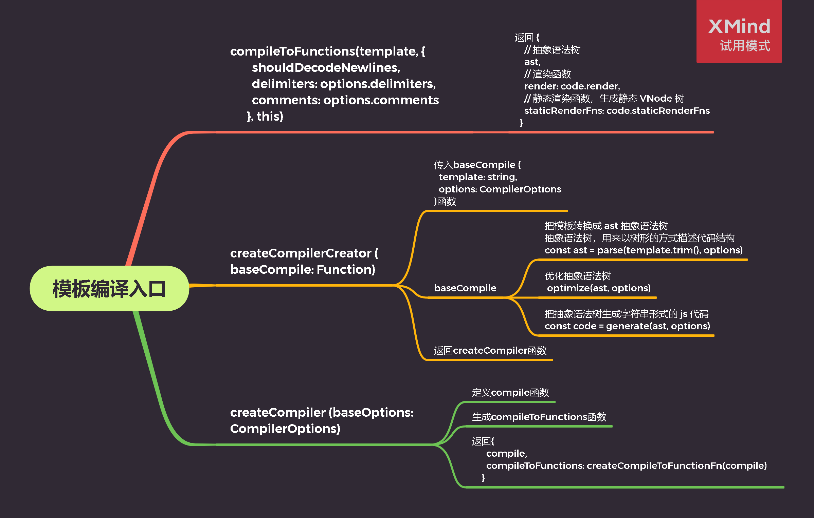
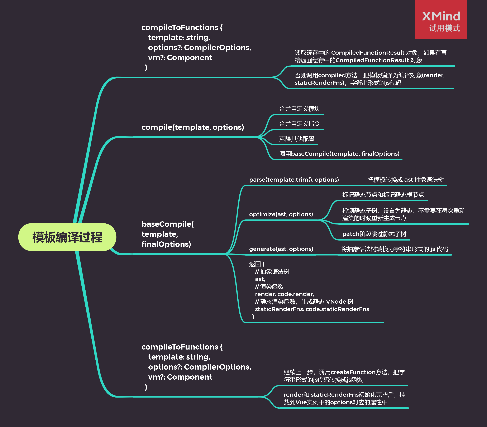

# Vue.js 源码剖析-模板编译

## Vue 模板编译

- 为什么需要模板编译

  Vue 2.x 使用 VNode 描述视图以及各种交互，用户自己编写 VNode 比较复杂

- 模板编译的目的
  - 将模板(template)字符串转换为渲染函数(render)
  - 用户只需要编写类似 HTML 的代码 - Vue 模板，通过编译器将模板转换为返回 VNode 的 render 函数
  - .vue 文件在 webpack 构建的过程中会被转换成 render 函数

## 沙盒工具

- [官方提供 Vue 2.x 模板编译沙盒](https://icqo5.csb.app/)

::: details 2.x 模板编译沙盒

<iframe src="https://icqo5.csb.app/" style="width: 100%; height: 500px; border: 0px; border-radius: 4px; overflow: hidden; --darkreader-inline-border-top: initial; --darkreader-inline-border-right: initial; --darkreader-inline-border-bottom: initial; --darkreader-inline-border-left: initial;" title="vue-20-template-compilation" allow="geolocation; microphone; camera; midi; vr; accelerometer; gyroscope; payment; ambient-light-sensor; encrypted-media; usb" sandbox="allow-modals allow-forms allow-popups allow-scripts allow-same-origin" data-darkreader-inline-border-top="" data-darkreader-inline-border-right="" data-darkreader-inline-border-bottom="" data-darkreader-inline-border-left=""></iframe>

:::

- [Vue 2.6 Template Explorer 模板编译沙盒](https://vue-template-explorer.netlify.app/#%3Cdiv%3E%0A%20%20%20%20%20%20%20%20%3Cheader%3E%0A%20%20%20%20%20%20%20%20%20%20%3Ch1%3EI'm%20a%20template!%3C%2Fh1%3E%0A%20%20%20%20%20%20%20%20%3C%2Fheader%3E%0A%20%20%20%20%20%20%20%20%3Cp%20v-if%3D%22message%22%3E%7B%7B%20message%20%7D%7D%3C%2Fp%3E%0A%20%20%20%20%20%20%20%20%3Cp%20v-else%3ENo%20message.%3C%2Fp%3E%0A%20%20%20%20%20%20%3C%2Fdiv%3E)

::: details Vue 2.6 Template Explorer

<iframe src="https://vue-template-explorer.netlify.app/#%3Cdiv%3E%0A%20%20%20%20%20%20%20%20%3Cheader%3E%0A%20%20%20%20%20%20%20%20%20%20%3Ch1%3EI'm%20a%20template!%3C%2Fh1%3E%0A%20%20%20%20%20%20%20%20%3C%2Fheader%3E%0A%20%20%20%20%20%20%20%20%3Cp%20v-if%3D%22message%22%3E%7B%7B%20message%20%7D%7D%3C%2Fp%3E%0A%20%20%20%20%20%20%20%20%3Cp%20v-else%3ENo%20message.%3C%2Fp%3E%0A%20%20%20%20%20%20%3C%2Fdiv%3E" style="width: 100%; height: 500px; border: 0px; border-radius: 4px; overflow: hidden; --darkreader-inline-border-top: initial; --darkreader-inline-border-right: initial; --darkreader-inline-border-bottom: initial; --darkreader-inline-border-left: initial;" title="vue-20-template-compilation" allow="geolocation; microphone; camera; midi; vr; accelerometer; gyroscope; payment; ambient-light-sensor; encrypted-media; usb" sandbox="allow-modals allow-forms allow-popups allow-scripts allow-same-origin" data-darkreader-inline-border-top="" data-darkreader-inline-border-right="" data-darkreader-inline-border-bottom="" data-darkreader-inline-border-left=""></iframe>

:::

- [Vue 3 Template Explorer 模板编译沙盒](https://vue-next-template-explorer.netlify.app/#%7B%22src%22%3A%22%3Cdiv%3E%5Cr%5Cn%20%20%3Cheader%3E%5Cr%5Cn%20%20%20%20%3Ch1%3EI'm%20a%20template!%3C%2Fh1%3E%5Cr%5Cn%20%20%3C%2Fheader%3E%5Cr%5Cn%20%20%3Cp%20v-if%3D%5C%22message%5C%22%3E%7B%7B%20message%20%7D%7D%3C%2Fp%3E%5Cr%5Cn%20%20%3Cp%20v-else%3ENo%20message.%3C%2Fp%3E%5Cr%5Cn%3C%2Fdiv%3E%22%2C%22ssr%22%3Afalse%2C%22options%22%3A%7B%22mode%22%3A%22function%22%2C%22prefixIdentifiers%22%3Afalse%2C%22optimizeImports%22%3Afalse%2C%22hoistStatic%22%3Afalse%2C%22cacheHandlers%22%3Afalse%2C%22scopeId%22%3Anull%2C%22ssrCssVars%22%3A%22%7B%20color%20%7D%22%2C%22bindingMetadata%22%3A%7B%22TestComponent%22%3A%22setup%22%2C%22foo%22%3A%22setup%22%2C%22bar%22%3A%22props%22%7D%7D%7D)

::: details Vue 3 Template Explorer

<iframe src="https://vue-next-template-explorer.netlify.app/#%7B%22src%22%3A%22%3Cdiv%3E%5Cr%5Cn%20%20%3Cheader%3E%5Cr%5Cn%20%20%20%20%3Ch1%3EI'm%20a%20template!%3C%2Fh1%3E%5Cr%5Cn%20%20%3C%2Fheader%3E%5Cr%5Cn%20%20%3Cp%20v-if%3D%5C%22message%5C%22%3E%7B%7B%20message%20%7D%7D%3C%2Fp%3E%5Cr%5Cn%20%20%3Cp%20v-else%3ENo%20message.%3C%2Fp%3E%5Cr%5Cn%3C%2Fdiv%3E%22%2C%22ssr%22%3Afalse%2C%22options%22%3A%7B%22mode%22%3A%22function%22%2C%22prefixIdentifiers%22%3Afalse%2C%22optimizeImports%22%3Afalse%2C%22hoistStatic%22%3Afalse%2C%22cacheHandlers%22%3Afalse%2C%22scopeId%22%3Anull%2C%22ssrCssVars%22%3A%22%7B%20color%20%7D%22%2C%22bindingMetadata%22%3A%7B%22TestComponent%22%3A%22setup%22%2C%22foo%22%3A%22setup%22%2C%22bar%22%3A%22props%22%7D%7D%7D" style="width: 100%; height: 500px; border: 0px; border-radius: 4px; overflow: hidden; --darkreader-inline-border-top: initial; --darkreader-inline-border-right: initial; --darkreader-inline-border-bottom: initial; --darkreader-inline-border-left: initial;" title="vue-20-template-compilation" allow="geolocation; microphone; camera; midi; vr; accelerometer; gyroscope; payment; ambient-light-sensor; encrypted-media; usb" sandbox="allow-modals allow-forms allow-popups allow-scripts allow-same-origin" data-darkreader-inline-border-top="" data-darkreader-inline-border-right="" data-darkreader-inline-border-bottom="" data-darkreader-inline-border-left=""></iframe>

:::

## 分析 render 函数

```javascript
function anonymous() {
  with (this) {
    return _c('div', [
      _m(0),
      message ? _c('p', [_v(_s(message))]) : _c('p', [_v('No message.')]),
    ]);
  }
}
```

- \_c 是 createElement() 方法，定义的位置 src/core/instance/render.js 中
- 相关的渲染函数(\_开头的方法定义)，在 src/core/instance/render-helps/index.js 中

```javascript
// src/core/instance/render.js
// 对编译生成的render进行渲染的方法
// 具体可前往上一章虚拟Dom源码剖析
vm._c = (a, b, c, d) => createElement(vm, a, b, c, d, false);

// src/core/instance/render-helps/index.js
// 生成文本虚拟节点
target._v = createTextVNode;
// 用于渲染静态资源的方法
target._m = renderStatic;
// 将数据转换为字符串格式
target._s = toString;

// src/core/vdom/vnode.js
// 生成文本虚拟节点
export function createTextVNode(val: string | number) {
  return new VNode(undefined, undefined, undefined, String(val));
}

// src/core/instance/render-helpers/render-static.js
/**
 * Runtime helper for rendering static trees.
 * 运行时，用于渲染静态抽象语法树
 */
export function renderStatic(
  index: number,
  isInFor?: boolean,
): VNode | Array<VNode> {
  // static trees can be rendered once and cached on the contructor options
  // so every instance shares the same cached trees
  // 静态树可以渲染一次并缓存在构造器选项上,每个实例共享相同的缓存中的静态树
  const renderFns = this.$options.staticRenderFns;
  const cached = renderFns.cached || (renderFns.cached = []);
  let tree = cached[index];
  // if has already-rendered static tree and not inside v-for,
  // we can reuse the same tree by doing a shallow clone.
  // 如果已经渲染了静态树而不是在v-for内部，
  // 我们可以通过执行浅复制来重用同一棵树。
  if (tree && !isInFor) {
    return Array.isArray(tree) ? cloneVNodes(tree) : cloneVNode(tree);
  }
  // otherwise, render a fresh tree.
  // 否则，渲染一棵新的树
  tree = cached[index] = renderFns[index].call(this._renderProxy, null, this);
  markStatic(tree, `__static__${index}`, false);
  return tree;
}

// src/shared/util.js
/**
 * Convert a value to a string that is actually rendered.
 * 将值转换为实字符串。
 */
export function toString(val: any): string {
  return val == null
    ? ''
    : typeof val === 'object'
    ? JSON.stringify(val, null, 2)
    : String(val);
}
```

## 编译过程

### 编译入口分析



- [src/platforms/web/entry-runtime-with-compiler.js](https://gitee.com/Wuner/vue-resovle/blob/master/src/platforms/web/entry-runtime-with-compiler.js)

```javascript
// 把 template 转换成 render 函数
const { render, staticRenderFns } = compileToFunctions(
  template,
  {
    shouldDecodeNewlines,
    delimiters: options.delimiters,
    comments: options.comments,
  },
  this,
);
```

- [src/platforms/web/compiler/index.js](https://gitee.com/Wuner/vue-resovle/blob/master/src/platforms/web/compiler/index.js)

```javascript
/* @flow */

import { baseOptions } from './options';
import { createCompiler } from 'compiler/index';

// baseOptions 平台相关的options
const { compile, compileToFunctions } = createCompiler(baseOptions);

export { compile, compileToFunctions };
```

- [src/compiler/index.js](https://gitee.com/Wuner/vue-resovle/blob/master/src/compiler/index.js)

```javascript
export const createCompiler = createCompilerCreator(function baseCompile(
  template: string,
  options: CompilerOptions,
): CompiledResult {
  // 把模板转换成 ast 抽象语法树
  // 抽象语法树，用来以树形的方式描述代码结构
  const ast = parse(template.trim(), options);
  // 优化抽象语法树
  optimize(ast, options);
  // 把抽象语法树生成字符串形式的 js 代码
  const code = generate(ast, options);
  return {
    // 抽象语法树
    ast,
    // 渲染函数
    render: code.render,
    // 静态渲染函数，生成静态 VNode 树
    staticRenderFns: code.staticRenderFns,
  };
});
```

- [src/compiler/create-compiler.js](https://gitee.com/Wuner/vue-resovle/blob/master/src/compiler/create-compiler.js)

```javascript
// baseOptions 平台相关的options
// src/platforms/web/compiler/options.js 中定义
export function createCompilerCreator(baseCompile: Function): Function {
  return function createCompiler(baseOptions: CompilerOptions) {
    function compile(
      template: string,
      options?: CompilerOptions,
    ): CompiledResult {
      const finalOptions = Object.create(baseOptions);
      const errors = [];
      const tips = [];
      finalOptions.warn = (msg, tip) => {
        (tip ? tips : errors).push(msg);
      };

      if (options) {
        // merge custom modules
        // 合并自定义模块
        if (options.modules) {
          finalOptions.modules = (baseOptions.modules || []).concat(
            options.modules,
          );
        }
        // merge custom directives
        // 合并自定义指令
        if (options.directives) {
          finalOptions.directives = extend(
            Object.create(baseOptions.directives),
            options.directives,
          );
        }
        // copy other options
        // 克隆其他配置
        for (const key in options) {
          if (key !== 'modules' && key !== 'directives') {
            finalOptions[key] = options[key];
          }
        }
      }

      const compiled = baseCompile(template, finalOptions);
      if (process.env.NODE_ENV !== 'production') {
        errors.push.apply(errors, detectErrors(compiled.ast));
      }
      compiled.errors = errors;
      compiled.tips = tips;
      return compiled;
    }

    return {
      compile,
      compileToFunctions: createCompileToFunctionFn(compile),
    };
  };
}
```

### 解析 - parse

解析器将模板解析为抽象语树 AST，只有将模板解析成 AST 后，才能基于它做优化或者生成代码字符串。

```javascript
/**
 * Convert HTML string to AST.
 * 将HTML字符串转换为AST
 */
export function parse(
  template: string,
  options: CompilerOptions,
): ASTElement | void {
  warn = options.warn || baseWarn;

  // 解析 options
  // no: false
  platformIsPreTag = options.isPreTag || no;
  platformMustUseProp = options.mustUseProp || no;
  platformGetTagNamespace = options.getTagNamespace || no;

  // 根据key获取options.modules对应的数据
  transforms = pluckModuleFunction(options.modules, 'transformNode');
  preTransforms = pluckModuleFunction(options.modules, 'preTransformNode');
  postTransforms = pluckModuleFunction(options.modules, 'postTransformNode');

  // delimiters完整版的vue才有，只有在编译的时候才会使用到，
  // 作用是改变差值表达式使用的符号
  // https://cn.vuejs.org/v2/api/#delimiters
  delimiters = options.delimiters;

  const stack = [];
  const preserveWhitespace = options.preserveWhitespace !== false;
  let root;
  let currentParent;
  let inVPre = false;
  let inPre = false;
  let warned = false;

  function warnOnce(msg) {
    if (!warned) {
      warned = true;
      warn(msg);
    }
  }

  function endPre(element) {
    // check pre state
    if (element.pre) {
      inVPre = false;
    }
    if (platformIsPreTag(element.tag)) {
      inPre = false;
    }
  }

  // 对模板解析
  parseHTML(template, {
    warn,
    expectHTML: options.expectHTML,
    isUnaryTag: options.isUnaryTag,
    canBeLeftOpenTag: options.canBeLeftOpenTag,
    shouldDecodeNewlines: options.shouldDecodeNewlines,
    shouldKeepComment: options.comments,
    // 解析过程中的回调函数，生成 AST
    start(tag, attrs, unary) {
      // check namespace.
      // inherit parent ns if there is one
      const ns =
        (currentParent && currentParent.ns) || platformGetTagNamespace(tag);

      // handle IE svg bug
      /* istanbul ignore if */
      if (isIE && ns === 'svg') {
        attrs = guardIESVGBug(attrs);
      }

      // 生成AST（抽象语法树）
      let element: ASTElement = createASTElement(tag, attrs, currentParent);
      if (ns) {
        element.ns = ns;
      }

      if (isForbiddenTag(element) && !isServerRendering()) {
        element.forbidden = true;
        process.env.NODE_ENV !== 'production' &&
          warn(
            'Templates should only be responsible for mapping the state to the ' +
              'UI. Avoid placing tags with side-effects in your templates, such as ' +
              `<${tag}>` +
              ', as they will not be parsed.',
          );
      }

      // apply pre-transforms
      for (let i = 0; i < preTransforms.length; i++) {
        element = preTransforms[i](element, options) || element;
      }

      // 跳过这个元素和它的子元素的编译过程。
      // 可以用来显示原始 Mustache 标签。
      // 跳过大量没有指令的节点会加快编译。
      // https://cn.vuejs.org/v2/api/#v-pre
      if (!inVPre) {
        processPre(element);
        if (element.pre) {
          inVPre = true;
        }
      }
      if (platformIsPreTag(element.tag)) {
        inPre = true;
      }
      if (inVPre) {
        // 处理el属性
        processRawAttrs(element);
      } else if (!element.processed) {
        // structural directives
        // 结构化指令的处理
        // v-for
        processFor(element);
        // v-if
        processIf(element);
        // v-once
        processOnce(element);
        // element-scope stuff
        // 处理el
        processElement(element, options);
      }

      // 检查根元素约束
      function checkRootConstraints(el) {
        if (process.env.NODE_ENV !== 'production') {
          if (el.tag === 'slot' || el.tag === 'template') {
            warnOnce(
              `Cannot use <${el.tag}> as component root element because it may ` +
                'contain multiple nodes.',
            );
          }
          if (el.attrsMap.hasOwnProperty('v-for')) {
            warnOnce(
              'Cannot use v-for on stateful component root element because ' +
                'it renders multiple elements.',
            );
          }
        }
      }

      // tree management
      // 抽象语法树管理
      if (!root) {
        root = element;
        checkRootConstraints(root);
      } else if (!stack.length) {
        // allow root elements with v-if, v-else-if and v-else
        // 允许根元素带有v-if，v-else-if和v-else
        if (root.if && (element.elseif || element.else)) {
          checkRootConstraints(element);
          // 将if语法树添加到根语法树里
          addIfCondition(root, {
            exp: element.elseif,
            block: element,
          });
        } else if (process.env.NODE_ENV !== 'production') {
          warnOnce(
            `Component template should contain exactly one root element. ` +
              `If you are using v-if on multiple elements, ` +
              `use v-else-if to chain them instead.`,
          );
        }
      }
      if (currentParent && !element.forbidden) {
        if (element.elseif || element.else) {
          // 处理if语法树
          processIfConditions(element, currentParent);
        } else if (element.slotScope) {
          // scoped slot
          currentParent.plain = false;
          const name = element.slotTarget || '"default"';
          (currentParent.scopedSlots || (currentParent.scopedSlots = {}))[
            name
          ] = element;
        } else {
          currentParent.children.push(element);
          element.parent = currentParent;
        }
      }
      if (!unary) {
        currentParent = element;
        stack.push(element);
      } else {
        endPre(element);
      }
      // apply post-transforms
      for (let i = 0; i < postTransforms.length; i++) {
        postTransforms[i](element, options);
      }
    },

    end() {
      // remove trailing whitespace
      // 删除尾部空格
      const element = stack[stack.length - 1];
      const lastNode = element.children[element.children.length - 1];
      if (lastNode && lastNode.type === 3 && lastNode.text === ' ' && !inPre) {
        element.children.pop();
      }
      // pop stack
      stack.length -= 1;
      currentParent = stack[stack.length - 1];
      endPre(element);
    },

    // 处理文本元素
    chars(text: string) {
      if (!currentParent) {
        if (process.env.NODE_ENV !== 'production') {
          if (text === template) {
            warnOnce(
              'Component template requires a root element, rather than just text.',
            );
          } else if ((text = text.trim())) {
            warnOnce(`text "${text}" outside root element will be ignored.`);
          }
        }
        return;
      }
      // IE textarea placeholder bug
      /* istanbul ignore if */
      if (
        isIE &&
        currentParent.tag === 'textarea' &&
        currentParent.attrsMap.placeholder === text
      ) {
        return;
      }
      const children = currentParent.children;
      text =
        inPre || text.trim()
          ? isTextTag(currentParent)
            ? text
            : decodeHTMLCached(text)
          : // only preserve whitespace if its not right after a starting tag
          preserveWhitespace && children.length
          ? ' '
          : '';
      if (text) {
        let expression;
        if (
          !inVPre &&
          text !== ' ' &&
          (expression = parseText(text, delimiters))
        ) {
          children.push({
            type: 2,
            expression,
            text,
          });
        } else if (
          text !== ' ' ||
          !children.length ||
          children[children.length - 1].text !== ' '
        ) {
          children.push({
            type: 3,
            text,
          });
        }
      }
    },
    // 处理注释元素
    comment(text: string) {
      currentParent.children.push({
        type: 3,
        text,
        isComment: true,
      });
    },
  });
  return root;
}
```

[Vue 官网查看](https://cn.vuejs.org/v2/guide/render-function.html#v-if-%E5%92%8C-v-for)

::: danger
v-if/v-for 结构化指令只能在编译阶段处理，如果我们要在 render 函数处理条件或循环只能使用
js 中的 if 和 for

在模板中使用的 v-if 和 v-for：

```html
<ul v-if="items.length">
  <li v-for="item in items">{{ item.name }}</li>
</ul>
<p v-else>No items found.</p>
```

这些都可以在渲染函数中用 JavaScript 的 if/else 和 map 来重写：

```javascript
props: ['items'],
render: function (createElement) {
  if (this.items.length) {
    return createElement('ul', this.items.map(function (item) {
      return createElement('li', item.name)
    }))
  } else {
    return createElement('p', 'No items found.')
  }
}
```

:::

- [AST tree 生成沙盒](https://astexplorer.net/#/gist/f409cd9d81c248be28486f20e174784c/a4ed34b2e2532619ca2a2b41317b45790026224b)

::: details AST tree 生成沙盒

<iframe src="https://astexplorer.net/#/gist/f409cd9d81c248be28486f20e174784c/a4ed34b2e2532619ca2a2b41317b45790026224b" style="width: 100%; height: 500px; border: 0px; border-radius: 4px; overflow: hidden; --darkreader-inline-border-top: initial; --darkreader-inline-border-right: initial; --darkreader-inline-border-bottom: initial; --darkreader-inline-border-left: initial;" title="vue-20-template-compilation" allow="geolocation; microphone; camera; midi; vr; accelerometer; gyroscope; payment; ambient-light-sensor; encrypted-media; usb" sandbox="allow-modals allow-forms allow-popups allow-scripts allow-same-origin" data-darkreader-inline-border-top="" data-darkreader-inline-border-right="" data-darkreader-inline-border-bottom="" data-darkreader-inline-border-left=""></iframe>

:::

### 优化 - optimize

- 优化抽象语法树
- 静态节点 --> 永远不会更改的节点
- 标记非静态节点和标记静态根节点
- 检测静态节点，设置为静态，不需要在每次重新渲染的时候重新生成节点
- patch 阶段跳过静态节点

[src/compiler/index.js](https://gitee.com/Wuner/vue-resovle/blob/master/src/compiler/index.js)

```javascript
// 优化抽象语法树
optimize(ast, options);
```

[src/compiler/optimizer.js](https://gitee.com/Wuner/vue-resovle/blob/master/src/compiler/optimizer.js)

```javascript
export function optimize(root: ?ASTElement, options: CompilerOptions) {
  if (!root) return;
  isStaticKey = genStaticKeysCached(options.staticKeys || '');
  isPlatformReservedTag = options.isReservedTag || no;
  // first pass: mark all non-static nodes.
  // 第一次通过：标记非静态节点。
  markStatic(root);
  // second pass: mark static roots.
  // 第二遍：标记静态根节点。
  markStaticRoots(root, false);
}

function markStatic(node: ASTNode) {
  // 判断当前的astNode是否是静态的
  node.static = isStatic(node);
  // 元素节点
  if (node.type === 1) {
    // do not make component slot content static. this avoids
    // 1. components not able to mutate slot nodes
    // 2. static slot content fails for hot-reloading
    // 不要将组件插槽的内容设为静态
    // 1.组件无法更改插槽节点
    // 2.静态插槽内容无法进行热重装

    // 是组件，不是slot，没有inline-template，直接返回，阻止向下执行
    if (
      !isPlatformReservedTag(node.tag) &&
      node.tag !== 'slot' &&
      node.attrsMap['inline-template'] == null
    ) {
      return;
    }
    // 遍历children
    for (let i = 0, l = node.children.length; i < l; i++) {
      const child = node.children[i];
      // 标记非静态
      markStatic(child);
      if (!child.static) {
        // 如果有一个child不是静态，设置当前节点不是静态
        node.static = false;
      }
    }
    // 处理条件渲染
    if (node.ifConditions) {
      for (let i = 1, l = node.ifConditions.length; i < l; i++) {
        const block = node.ifConditions[i].block;
        // 标记非静态
        markStatic(block);
        if (!block.static) {
          // 如果有一个block不是静态，设置当前节点不是静态
          node.static = false;
        }
      }
    }
  }
}

function markStaticRoots(node: ASTNode, isInFor: boolean) {
  // 判断是否为元素节点
  if (node.type === 1) {
    // 判断当前节点是否是静态节点或者是否只渲染一次
    if (node.static || node.once) {
      // 标记其在for循环中是否是静态的
      node.staticInFor = isInFor;
    }
    // For a node to qualify as a static root, it should have children that
    // are not just static text. Otherwise the cost of hoisting out will
    // outweigh the benefits and it's better off to just always render it fresh.
    // 如果一个元素内只有文本节点，此时这个元素不是静态的Root
    // vue 认为这种优化会带来负面的影响

    // 判断当前节点是静态节点，并且存在子节点，并且当前节点的子节点不能只存在一个文本节点
    // 如果不满足，优化成本将大于收益
    if (
      node.static &&
      node.children.length &&
      !(node.children.length === 1 && node.children[0].type === 3)
    ) {
      // 标记根节点为静态
      node.staticRoot = true;
      return;
    } else {
      // 标记根节点为非静态
      node.staticRoot = false;
    }
    // 检测当前节点的子节点中是否有静态的Root
    if (node.children) {
      for (let i = 0, l = node.children.length; i < l; i++) {
        markStaticRoots(node.children[i], isInFor || !!node.for);
      }
    }
    // 检测当前节点的条件渲染中是否有静态的Root
    if (node.ifConditions) {
      for (let i = 1, l = node.ifConditions.length; i < l; i++) {
        markStaticRoots(node.ifConditions[i].block, isInFor);
      }
    }
  }
}

function isStatic(node: ASTNode): boolean {
  if (node.type === 2) {
    // expression 表达式
    return false;
  }
  if (node.type === 3) {
    // text 文本
    return true;
  }
  return !!(
    node.pre ||
    (!node.hasBindings && // no dynamic bindings
    !node.if &&
    !node.for && // not v-if or v-for or v-else
    !isBuiltInTag(node.tag) && // not a built-in 不能是内置组件
    isPlatformReservedTag(node.tag) && // not a component 不能是组件
    !isDirectChildOfTemplateFor(node) && // 不能是v-for下的直接节点
      Object.keys(node).every(isStaticKey))
  );
}
```

### 生成 - generate

- 将抽象语法树转换为字符串形式的 js 代码

[src/compiler/index.js](https://gitee.com/Wuner/vue-resovle/blob/master/src/compiler/index.js)

```javascript
// 将抽象语法树转换为字符串形式的 js 代码
const code = generate(ast, options);
```

[src/compiler/codegen/index.js](https://gitee.com/Wuner/vue-resovle/blob/master/src/compiler/codegen/index.js)

```javascript
export function generate(
  ast: ASTElement | void,
  options: CompilerOptions,
): CodegenResult {
  // CodegenState 代码生成过程中使用的状态对象
  const state = new CodegenState(options);
  // 如果存在ast，生成代码，否则返回_c("div")
  const code = ast ? genElement(ast, state) : '_c("div")';
  return {
    render: `with(this){return ${code}}`,
    // 静态渲染函数，即静态根节点的渲染函数
    staticRenderFns: state.staticRenderFns,
  };
}

export function genElement(el: ASTElement, state: CodegenState): string {
  // el.staticProcessed用于判断当前静态根节点是否已处理，防止重复处理
  if (el.staticRoot && !el.staticProcessed) {
    return genStatic(el, state);
  } else if (el.once && !el.onceProcessed) {
    return genOnce(el, state);
  } else if (el.for && !el.forProcessed) {
    return genFor(el, state);
  } else if (el.if && !el.ifProcessed) {
    return genIf(el, state);
    // 以下处理非静态节点
  } else if (el.tag === 'template' && !el.slotTarget) {
    return genChildren(el, state) || 'void 0';
  } else if (el.tag === 'slot') {
    return genSlot(el, state);
  } else {
    // component or element
    // 处理组件和内置标签
    let code;
    if (el.component) {
      code = genComponent(el.component, el, state);
    } else {
      // 生成元素的属性/指令/事件等
      // 处理各种指令，包括genDirective(model/text/html)
      const data = el.plain ? undefined : genData(el, state);

      // 将节点转换为相应的代码
      const children = el.inlineTemplate ? null : genChildren(el, state, true);
      code = `_c('${el.tag}'${
        data ? `,${data}` : '' // data
      }${
        children ? `,${children}` : '' // children
      })`;
    }
    // module transforms
    for (let i = 0; i < state.transforms.length; i++) {
      code = state.transforms[i](el, code);
    }
    return code;
  }
}

// hoist static sub-trees out
function genStatic(el: ASTElement, state: CodegenState): string {
  // 将状态置为已处理
  el.staticProcessed = true;
  // 将静态根节点转换为生成vnode的js代码
  state.staticRenderFns.push(`with(this){return ${genElement(el, state)}}`);
  return `_m(${state.staticRenderFns.length - 1}${
    el.staticInFor ? ',true' : ''
  })`;
}
```

### 总结


