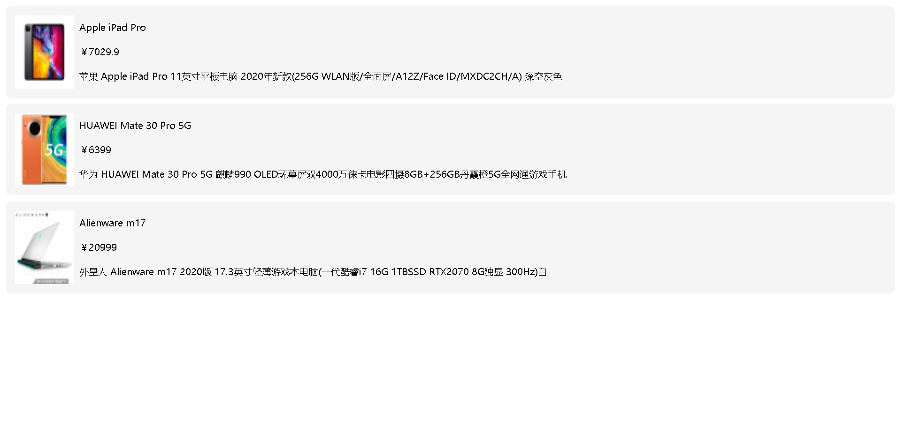

# 服务端渲染（SSR）

## 概述

随着前端技术栈和工具链的迭代成熟，前端工程化、模块化也已成为了当下的主流技术方案，在这波前端技术浪潮中，涌现了诸如 React、Vue、Angular 等基于客户端渲染的前端框架，这类框架所构建的单页应用（SPA）具有用户体验好、渲染性能好、可维护性高等优点。但也也有一些很大的缺陷，其中主要涉及到以下两点：

- 首屏加载时间过长

  与传统服务端渲染直接获取服务端渲染好的 HTML 不同，单页应用使用 JavaScript 在客户端生成 HTML 来呈现内容，用户需要等待客户端 JS 解析执行完成才能看到页面，这就使得首屏加载时间变长，从而影响用户体验。

- 不利于 SEO

  当搜索引擎爬取网站 HTML 文件时，单页应用的 HTML 没有内容，因为他它需要通过客户端 JavaScript 解析执行才能生成网页内容，而目前的主流的搜索引擎对于这一部分内容的抓取还不是很好。

为了解决这两个缺陷，业界借鉴了传统的服务端直出 HTML 方案，提出在服务器端执行前端框架（React/Vue/Angular）代码生成网页内容，然后将渲染好的网页内容返回给客户端，客户端只需要负责展示就可以了；


当然不仅仅如此，为了获得更好的用户体验，同时会在客户端将来自服务端渲染的内容激活为一个 SPA 应用，也就是说之后的页面内容交互都是通过客户端渲染处理。


这种方式简而言之就是：

- 通过服务端渲染首屏直出，解决首屏渲染慢以及不利于 SEO 问题
- 通过客户端渲染接管页面内容交互得到更好的用户体验

这种方式我们通常称之为现代化的服务端渲染，也叫同构渲染，所谓的同构指的就是服务端构建渲染 + 客户端构建渲染。同理，这种方式构建的应用称之为服务端渲染应用或者是同构应用。

## 什么是渲染？

我们这里所说的渲染指的是把（数据 + 模板）拼接到一起的这个事儿。

例如对于我们前端开发者来说最常见的一种场景就是：请求后端接口数据，然后将数据通过模板绑定语法绑定到页面中，最终呈现给用户。这个过程就是我们这里所指的渲染。

渲染本质其实就是字符串的解析替换，实现方式有很多种；但是我们这里要关注的并不是如何渲染，而是在哪里渲染的问题

## 传统的服务端渲染

最早期，Web 页面渲染都是在服务端完成的，即服务端运行过程中将所需的数据结合页面模板渲染为 HTML，响应给客户端浏览器。所以浏览器呈现出来的是直接包含数据内容的页面。

工作流程：


这种方式的代表性技术有：ASP、PHP、JSP，再到后来的一些相对高级一点的服务端框架配合一些模板引擎。

接下来我们来写一个 demo，来了解一下传统的服务端渲染

### 安装依赖

node http 服务

```
yarn add express cors -D
// 或者
npm i express cors -D
```

服务端模板引擎

```
yarn add art-template express-art-template -D
// 或者
npm i art-template express-art-template -D
```

### 服务端代码：

- 基本的 Web 服务
- 使用模板引擎
- 渲染一个页面
- 返回渲染好的页面

ssr/index.js

```javascript
/**
 * @author Wuner
 * @date 2020/8/22 22:12
 * @description
 */
const express = require('express');
const cors = require('cors');
const app = express();
const template = require('art-template');
const fs = require('fs');
// 动态获取本机ip
const getIPAddress = require('../../utils/getIPAddress');

app.use(cors());

const hostname = getIPAddress();
const port = 3000;

const _products = {
  code: 200,
  message: 'success',
  data: [
    {
      id: 1,
      title: 'Apple iPad Pro',
      desc:
        '苹果 Apple iPad Pro 11英寸平板电脑 2020年新款(256G WLAN版/全面屏/A12Z/Face ID/MXDC2CH/A) 深空灰色',
      price: 7029.9,
      thumb:
        'http://img14.360buyimg.com/n5/s54x54_jfs/t1/93232/3/15628/251953/5e723c47E54d3aff9/9d083eaea3409b83.jpg',
    },
    {
      id: 2,
      title: 'HUAWEI Mate 30 Pro 5G',
      desc:
        '华为 HUAWEI Mate 30 Pro 5G 麒麟990 OLED环幕屏双4000万徕卡电影四摄8GB+256GB丹霞橙5G全网通游戏手机',
      price: 6399.0,
      thumb:
        'http://img14.360buyimg.com/n5/s54x54_jfs/t1/90139/34/1379/180822/5dbe8875E02dc2e95/c78c80a4116ee57d.jpg',
    },
    {
      id: 3,
      title: 'Alienware m17',
      desc:
        '外星人 Alienware m17 2020版 17.3英寸轻薄游戏本电脑(十代酷睿i7 16G 1TBSSD RTX2070 8G独显 300Hz)白',
      price: 20999.0,
      thumb:
        'https://img14.360buyimg.com/n5/s54x54_jfs/t1/142119/22/4704/50705/5f2cec4eE2e06b218/e50debd5955af768.jpg',
    },
  ],
};

app.use(express.json());

app.get('/productsPage', (req, res) => {
  // 1. 得到模板内容
  const templateStr = fs.readFileSync('src/view/ssr/index.html', 'utf-8');
  // 2. 得到数据
  // 3. 渲染：数据 + 模板 = 完整结果
  const html = template.render(templateStr, _products);
  // 4. 把渲染结果发送给客户端
  res.send(html);
});

app.listen(port, hostname, (val) => {
  console.log(`Server is running at http://${hostname}:${port}/`);
});
```

### 客户端代码：

ssr/index.html

```html
<!DOCTYPE html>
<html lang="en">
  <head>
    <meta charset="UTF-8" />
    <title>Title</title>
    <style>
      * {
        margin: 0;
        padding: 0;
      }

      ul li {
        display: flex;
        flex-wrap: wrap;
        margin: 10px 10px 0 10px;
        padding: 16px;
        border-radius: 10px;
        background-color: #f5f5f5;
      }

      img {
        width: 100px;
        height: auto;
        margin-right: 10px;
      }
      P {
        padding: 10px 0;
      }
    </style>
  </head>
  <body>
    <ul>
      {{ each data }}
      <li>
        
        <div>
          <p>{{ $value.title }}</p>
          <p>￥{{ $value.price }}</p>
          <p>
            {{ $value.desc }}
          </p>
        </div>
      </li>
      {{ /each }}
    </ul>
  </body>
</html>
```

### 运行测试

- 启动服务
- 浏览器上输入，控制台输入的地址+productsPage(http://xxx:3000/productsPage)

```
node ssr/index.js
```



这也就是最早的网页渲染方式，也就是动态网站的核心工作步骤。在这样的一个工作过程中，因为页面中的内容不是固定的，它有一些动态的内容。

在今天看来，这种渲染模式是不合理或者说不先进的。因为在当下这种网页越来越复杂的情况下，这种模式存在很多明显的不足：

- 应用的前后端部分完全耦合在一起，在前后端协同开发方面会有非常大的阻力；
- 前端没有足够的发挥空间，无法充分利用现在前端生态下的一些更优秀的方案；
- 由于内容都是在服务端动态生成的，所以服务端的压力较大；相比目前流行的 SPA 应用来说，用户体验一般；

但是不得不说，在网页应用并不复杂的情况下，这种方式也是可取的。

## 客户端渲染

传统的服务端渲染有很多问题，但是这些问题随着客户端 Ajax 技术的普及得到了有效的解决，Ajax 技术可以使得客户端动态获取数据变为可能，也就是说原本服务端渲染这件事儿也可以拿到客户端做了。

下面是基于客户端渲染的 SPA 应用的基本工作流程。


下面我们以一个 Vue.js 创建的单页面应用为例来了解一下这种方式的渲染过程。

ssr/index.js

```javascript
/**
 * @author Wuner
 * @date 2020/8/22 22:12
 * @description
 */
const express = require('express');
const cors = require('cors');
const app = express();
const template = require('art-template');
const fs = require('fs');
// 动态获取本机ip
const getIPAddress = require('../../utils/getIPAddress');

app.use(cors());

const hostname = getIPAddress();
const port = 3000;

const _products = {
  code: 200,
  message: 'success',
  data: [
    {
      id: 1,
      title: 'Apple iPad Pro',
      desc:
        '苹果 Apple iPad Pro 11英寸平板电脑 2020年新款(256G WLAN版/全面屏/A12Z/Face ID/MXDC2CH/A) 深空灰色',
      price: 7029.9,
      thumb:
        'http://img14.360buyimg.com/n5/s54x54_jfs/t1/93232/3/15628/251953/5e723c47E54d3aff9/9d083eaea3409b83.jpg',
    },
    {
      id: 2,
      title: 'HUAWEI Mate 30 Pro 5G',
      desc:
        '华为 HUAWEI Mate 30 Pro 5G 麒麟990 OLED环幕屏双4000万徕卡电影四摄8GB+256GB丹霞橙5G全网通游戏手机',
      price: 6399.0,
      thumb:
        'http://img14.360buyimg.com/n5/s54x54_jfs/t1/90139/34/1379/180822/5dbe8875E02dc2e95/c78c80a4116ee57d.jpg',
    },
    {
      id: 3,
      title: 'Alienware m17',
      desc:
        '外星人 Alienware m17 2020版 17.3英寸轻薄游戏本电脑(十代酷睿i7 16G 1TBSSD RTX2070 8G独显 300Hz)白',
      price: 20999.0,
      thumb:
        'https://img14.360buyimg.com/n5/s54x54_jfs/t1/142119/22/4704/50705/5f2cec4eE2e06b218/e50debd5955af768.jpg',
    },
  ],
};

app.use(express.json());

app.get('/productsPage', (req, res) => {
  // 1. 得到模板内容
  const templateStr = fs.readFileSync('src/view/ssr/index.html', 'utf-8');
  // 2. 得到数据
  // 3. 渲染：数据 + 模板 = 完整结果
  const html = template.render(templateStr, _products);
  // 4. 把渲染结果发送给客户端
  res.send(html);
});

app.get('/products', (req, res) => {
  res.send(_products);
});

app.listen(port, hostname, (val) => {
  console.log(`Server is running at http://${hostname}:${port}/`);
});
```

csr/index.vue

```vue
<template>
  <div class="csr">
    <ul>
      <li v-for="production in productions" :key="production.id">
        
        <div>
          <p>{{ production.title }}</p>
          <p>￥{{ production.price }}</p>
          <p>
            {{ production.desc }}
          </p>
        </div>
      </li>
    </ul>
  </div>
</template>

<script>
export default {
  data() {
    return { productions: [] };
  },
  methods: {},
  async created() {
    this.productions = await this.$http.get(
      `http://${process.env.HOST}:3000/products`,
    );
  },
  mounted() {},
  computed: {},
};
</script>
<style scoped lang="less">
.csr {
  * {
    margin: 0;
    padding: 0;
  }

  ul li {
    display: flex;
    flex-wrap: wrap;
    margin: 10px 10px 0 10px;
    padding: 16px;
    border-radius: 10px;
    background-color: #f5f5f5;
  }

  img {
    width: 100px;
    height: auto;
    margin-right: 10px;
  }
  p {
    padding: 10px 0;
  }
}
</style>
```

通过这个示例可以了解到我们就可以把【数据处理】和【页面渲染】这两件事儿分开了，也就是【后端】负责数据处理，【前端】负责页面渲染，这种分离模式极大的提高了开发效率和可维护性。

而且这样一来，【前端】更为独立，也不再受限制于【后端】，它可以选择任意的技术方案或框架来处理页面渲染。

但是这种模式下，也会存在一些明显的不足，其中最主要的就是：

- 首屏渲染慢

  - 客户端渲染时间

    

  - 服务端渲染时间

    

  - 从上述可以看出，客户端渲染时间远大于服务端渲染时间
  - 因为 HTML 中没有内容，必须等到 JavaScript 加载并执行完成才能呈现页面内容。

- SEO 问题：

  - 模拟爬虫

    ```javascript
    /**
     * @author Wuner
     * @date 2020/8/23 1:15
     * @description
     */
    const http = require('http');

    http.get('http://192.168.0.100:8000/', (res) => {
      let data = '';
      res.on('data', (chunk) => {
        data += chunk;
      });

      res.on('end', () => {
        console.log('==============客户端日志开始=================' + '\n');
        console.log(data);
        console.log('==============客户端日志结束=================' + '\n');
      });
    });

    http.get('http://192.168.0.100:3000/productsPage', (res) => {
      let data = '';
      res.on('data', (chunk) => {
        data += chunk;
      });

      res.on('end', () => {
        console.log('==============服务端日志开始=================' + '\n');
        console.log(data);
        console.log('==============服务端日志结束=================' + '\n');
      });
    });
    ```

    - 打印

    ```
    ==============客户端日志开始=================

    <!DOCTYPE html>
    <html lang="zh-cmn-Hans">
    <head>
      <meta charset="utf-8">
      <title>template</title>
    <link href="/css/app.css" rel="stylesheet"></head>
    <body>
    <div id="app"></div>
    <!-- built files will be auto injected -->
    <script type="text/javascript" src="/js/vendors.js"></script><script type="text/javascript" src="/js/app.js"></script></body>
    </html>

    ==============客户端日志结束=================

    ==============服务端日志开始=================

    <!DOCTYPE html>
    <html lang="en">
    <head>
      <meta charset="UTF-8">
      <title>Title</title>
      <style>
          * {
              margin: 0;
              padding: 0
          }

          ul li {
              display: flex;
              flex-wrap: wrap;
              margin: 10px 10px 0 10px;
              padding: 16px;
              border-radius: 10px;
              background-color: #f5f5f5;
          }

          img {
              width: 100px;
              height: auto;
              margin-right: 10px;
          }
          P{
              padding: 10px 0;
          }
      </style>
    </head>
    <body>
    <ul>

      <li>
        
        <div>
          <p>Apple iPad Pro</p>
          <p>￥7029.9</p>
          <p>
            苹果 Apple iPad Pro 11英寸平板电脑 2020年新款(256G WLAN版/全面屏/A12Z/Face ID/MXDC2CH/A) 深空灰色
          </p>
        </div>
      </li>

      <li>
        
        <div>
          <p>HUAWEI Mate 30 Pro 5G</p>
          <p>￥6399</p>
          <p>
            华为 HUAWEI Mate 30 Pro 5G 麒麟990 OLED环幕屏双4000万徕卡电影四摄8GB+256GB丹霞橙5G全网通游戏手机
          </p>
        </div>
      </li>

      <li>
        
        <div>
          <p>Alienware m17</p>
          <p>￥20999</p>
          <p>
            外星人 Alienware m17 2020版 17.3英寸轻薄游戏本电脑(十代酷睿i7 16G 1TBSSD RTX2070 8G独显 300Hz)白
          </p>
        </div>
      </li>

    </ul>
    </body>
    </html>

    ==============服务端日志结束=================
    ```

    - 上述日志打印可以看出，客户端首次 HTML 中没有内容，所以对于目前的搜索引擎爬虫来说，页面中没有任何有用的信息，自然无法提取关键词，进行索引了。

对于客户端渲染的 SPA 应用的问题有没有解决方案呢？

- 服务端渲染，严格来说是现代化的服务端渲染，也叫同构渲染

## 现代化的服务端渲染

客户端明显存在两个问题：

- 首屏渲染慢
- 不利于 SEO

我们只是把问题抛出来了，那有没有解决办法呢？

答案就是：服务端渲染。

也就是将客户端渲染的工作放到服务端渲染，这个问题不就解决了吗？

但是你们应该会有困惑，这不是又回到了服务端渲染的问题了么？

其实不然，虽说本质上确实是需要使用到传统的服务端渲染，但是严格来讲应该叫现代化的服务端渲染，也叫同构渲染(服务端渲染 + 客户端渲染)

### 为什么使用现代化的服务端渲染 (SSR)？

与传统 SPA (单页应用程序 (Single-Page Application)) 相比，服务器端渲染 (SSR) 的优势主要在于：

- 更好的 SEO，由于搜索引擎爬虫抓取工具可以直接查看完全渲染的页面。
  :::warning

  请注意，截至目前，Google 和 Bing 可以很好对同步 JavaScript 应用程序进行索引。在这里，同步是关键。如果你的应用程序初始展示 loading 菊花图，然后通过 Ajax 获取内容，抓取工具并不会等待异步完成后再行抓取页面内容。也就是说，如果 SEO 对你的站点至关重要，而你的页面又是异步获取内容，则你可能需要服务器端渲染(SSR)解决此问题。

  :::

- 更快的内容到达时间 (time-to-content)，特别是对于缓慢的网络情况或运行缓慢的设备。无需等待所有的 JavaScript 都完成下载并执行，才显示服务器渲染的标记，所以你的用户将会更快速地看到完整渲染的页面。通常可以产生更好的用户体验，并且对于那些「内容到达时间(time-to-content) 与转化率直接相关」的应用程序而言，服务器端渲染 (SSR) 至关重要。

:::tip

使用服务器端渲染 (SSR) 时还需要有一些权衡之处：

- 开发成本高。浏览器特定的代码，只能在某些生命周期钩子函数 (lifecycle hook) 中使用；一些外部扩展库 (external library) 可能需要特殊处理，才能在服务器渲染应用程序中运行。

- 涉及构建设置和部署的更多要求。与可以部署在任何静态文件服务器上的完全静态单页面应用程序 (SPA) 不同，服务器渲染应用程序，需要处于 Node.js server 运行环境。

- 更多的服务器端负载。在 Node.js 中渲染完整的应用程序，显然会比仅仅提供静态文件的 server 更加大量占用 CPU 资源 (CPU-intensive - CPU 密集)，因此如果你预料在高流量环境 (high traffic) 下使用，请准备相应的服务器负载，并明智地采用缓存策略。

:::

在对你的应用程序使用服务器端渲染 (SSR) 之前，你应该问的第一个问题是，是否真的需要它。这主要取决于内容到达时间 (time-to-content) 对应用程序的重要程度。例如，如果你正在构建一个内部仪表盘，初始加载时的额外几百毫秒并不重要，这种情况下去使用服务器端渲染 (SSR) 将是一个小题大作之举。然而，内容到达时间 (time-to-content) 要求是绝对关键的指标，在这种情况下，服务器端渲染 (SSR) 可以帮助你实现最佳的初始加载性能。

事实上，很多网站是出于效益的考虑才启用服务端渲染，性能倒是在其次。 假设 A 网站页面中有一个关键字叫“前端性能优化”，这个关键字是 JS 代码跑过一遍后添加到 HTML 页面中的。那么客户端渲染模式下，我们在搜索引擎搜索这个关键字，是找不到 A 网站的——搜索引擎只会查找现成的内容，不会帮你跑 JS 代码。A 网站的运营方见此情形，感到很头大：搜索引擎搜不出来，用户找不到我们，谁还会用我的网站呢？为了把“现成的内容”拿给搜索引擎看，A 网站不得不启用服务端渲染。 但性能在其次，不代表性能不重要。

### 现代化服务端渲染框架

- React 生态中的 [Next.js](https://nextjs.frontendx.cn/)
- Vue 生态中的 [Nuxt.js](https://www.nuxtjs.cn/)
- Angular 生态中的 [Angular Universal](https://angular.cn/guide/universal)
