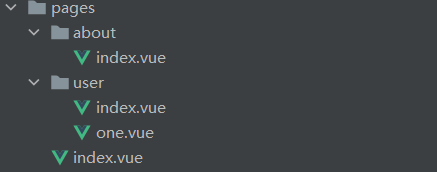

# [Nuxt.js](https://zh.nuxtjs.org/)

## 介绍

### Nuxt.js 是什么？

Nuxt.js 是一个基于 Vue.js 的通用应用框架。

通过对客户端/服务端基础架构的抽象组织，Nuxt.js 主要关注的是应用的 UI 渲染。

我们的目标是创建一个灵活的应用框架，你可以基于它初始化新项目的基础结构代码，或者在已有 Node.js 项目中使用 Nuxt.js。

Nuxt.js 预设了利用 Vue.js 开发**服务端渲染**的应用所需要的各种配置。

除此之外，我们还提供了一种命令叫：`nuxt generate` ，为基于 Vue.js 的应用提供生成对应的静态站点的功能。

我们相信这个命令所提供的功能，是向开发集成各种微服务（Microservices）的 Web 应用迈开的新一步。

作为框架，Nuxt.js 为 `客户端/服务端` 这种典型的应用架构模式提供了许多有用的特性，例如异步数据加载、中间件支持、布局支持等。

### Nuxt.js 框架是如何运作的？


- Vue.js
- Vue-Router
- Vuex (当配置了 Vuex 状态树配置项 时才会引入)
- Vue 服务器端渲染 (排除使用 mode: 'spa')
- Vue-Meta

:::tip

压缩并 gzip 后，总代码大小为：57kb （如果使用了 Vuex 特性的话为 60kb）。

另外，Nuxt.js 使用 Webpack 和 vue-loader 、 babel-loader 来处理代码的自动化构建工作（如打包、代码分层、压缩等等）。

:::

### 特性

- 基于 Vue.js

  - Vue、Vue Router、Vuex、Vue SSR

- 自动代码分层
- 服务端渲染
- 强大的路由功能，支持异步数据
- 静态文件服务
- ES2015+ 语法支持
- 打包和压缩 JS 和 CSS
- HTML 头部标签管理
- 本地开发支持热加载
- 集成 ESLint
- 支持各种样式预处理器： SASS、LESS、 Stylus 等等
- 支持 HTTP/2 推送

## 创建项目

Nuxt 提供了两种方式用来创建项目：

- 使用 create-nuxt-app 脚手架工具
- 手动创建

这里介绍手动创建 Nuxt 项目

### 准备工作

```
// 创建项目文件夹
mkdir nuxtjs-demo

// 进入项目文件夹
cd nuxtjs-demo

// 初始化 package.json
yarn init -y
// 或者
npm init -y

// 安装 nuxt
yarn add nuxt -D
// 或者
npm i nuxt -D
```

### 配置 nuxt 运行脚本

package.json

```json
{
  "name": "nuxtjs-demo",
  "scripts": {
    "dev": "nuxt"
  },
  "version": "1.0.0",
  "main": "index.js",
  "license": "MIT",
  "devDependencies": {
    "nuxt": "^2.14.3"
  }
}
```

上面的配置使得我们可以通过运行 `npm run dev` 或者 `yarn dev` 来运行 nuxt。

### 新建 vue 页面并启动项目

Nuxt.js 会依据 pages 目录中的所有 \*.vue 文件生成应用的路由配置。

```
// 创建pages 文件夹
mkdir pages
```

新建`pages/index.vue`

```vue
<template>
  <div class="home">
    <h2>hello nuxt.js</h2>
  </div>
</template>
```

启动项目

```
npm run dev
// 或者
yarn dev
```

:::tip

第一次启动项目，其会询问你是否加入他们，直接`N`就行了

注意：Nuxt.js 会监听 pages 目录中的文件更改，因此在添加新页面时无需重新启动应用程序。

:::

## router

### 基本使用

Nuxt.js 依据 `pages` 目录结构自动生成 `vue-router` 模块的路由配置。

:::tip

要在页面之间使用路由，我们建议使用`<nuxt-link>`标签。

:::

pages 目录结构



生成对应的 vue-router 配置

- .nuxt/router.js

```javascript
import Vue from 'vue';
import Router from 'vue-router';
import { interopDefault } from './utils';
import scrollBehavior from './router.scrollBehavior.js';

const _6f480cd4 = () =>
  interopDefault(
    import(
      '..\\pages\\about\\index.vue' /* webpackChunkName: "pages/about/index" */
    ),
  );
const _9b58e274 = () =>
  interopDefault(
    import(
      '..\\pages\\user\\index.vue' /* webpackChunkName: "pages/user/index" */
    ),
  );
const _f046dd4c = () =>
  interopDefault(
    import('..\\pages\\user\\one.vue' /* webpackChunkName: "pages/user/one" */),
  );
const _2585f79e = () =>
  interopDefault(
    import('..\\pages\\index.vue' /* webpackChunkName: "pages/index" */),
  );

// TODO: remove in Nuxt 3
const emptyFn = () => {};
const originalPush = Router.prototype.push;
Router.prototype.push = function push(location, onComplete = emptyFn, onAbort) {
  return originalPush.call(this, location, onComplete, onAbort);
};

Vue.use(Router);

export const routerOptions = {
  mode: 'history',
  base: decodeURI('/'),
  linkActiveClass: 'nuxt-link-active',
  linkExactActiveClass: 'nuxt-link-exact-active',
  scrollBehavior,

  routes: [
    {
      path: '/about',
      component: _6f480cd4,
      name: 'about',
    },
    {
      path: '/user',
      component: _9b58e274,
      name: 'user',
    },
    {
      path: '/user/one',
      component: _f046dd4c,
      name: 'user-one',
    },
    {
      path: '/',
      component: _2585f79e,
      name: 'index',
    },
  ],

  fallback: false,
};

export function createRouter() {
  return new Router(routerOptions);
}
```

### 路由导航

使用基本与 [vue-router](https://router.vuejs.org/zh/) 一致

a 标签

```vue
<template>
  <!--会刷新页面，走服务端渲染-->
  <a href="/">home</a>
</template>
```

`<nuxt-link>` 组件

```vue
<template>
  <!--  nuxt.js的路由组件，使用与router-link基本一致-->
  <nuxt-link to="/">home</nuxt-link>
</template>
```

编程式导航

```vue
<template>
  <button @click="$router.push('/')">home</button>
</template>
```

### 动态路由

在 `Nuxt.js` 里面定义带参数的动态路由，需要创建对应的**以下划线作为前缀**的 Vue 文件 或 目录。

以下目录结构：

```
pages/
--| _slug/
-----| comments.vue
-----| index.vue
--| users/
-----| _id.vue
--| index.vue
```

Nuxt.js 生成对应的路由配置表为：

```javascript
router: {
  routes: [
    {
      name: 'index',
      path: '/',
      component: 'pages/index.vue',
    },
    {
      name: 'users-id',
      path: '/users/:id?',
      component: 'pages/users/_id.vue',
    },
    {
      name: 'slug',
      path: '/:slug',
      component: 'pages/_slug/index.vue',
    },
    {
      name: 'slug-comments',
      path: '/:slug/comments',
      component: 'pages/_slug/comments.vue',
    },
  ];
}
```

你会发现名称为<font>users-id</font>的路由路径带有<font>:id?</font>参数，表示该路由是可选的。如果你想将它设置为必选的路由，需要在<font>users/\_id</font>目录内创建一个<font>index.vue</font>文件。

:::warning

generate 命令会忽略动态路由: [API Configuration generate](https://zh.nuxtjs.org/api/configuration-generate#routes)

:::

### 嵌套路由

你可以通过 vue-router 的子路由创建 Nuxt.js 应用的嵌套路由。

创建内嵌子路由，你需要添加一个 Vue 文件，同时添加一个与该文件同名的目录用来存放子视图组件。

:::warning

别忘了在父组件(<font>.vue</font>文件) 内增加 `<nuxt-child/>` 用于显示子视图内容。

:::

假设文件结构如：

```
pages/
--| users/
-----| _id.vue
-----| index.vue
--| users.vue
```

Nuxt.js 自动生成的路由配置如下：

```javascript
router: {
  routes: [
    {
      path: '/users',
      component: 'pages/users.vue',
      children: [
        {
          path: '',
          component: 'pages/users/index.vue',
          name: 'users',
        },
        {
          path: ':id',
          component: 'pages/users/_id.vue',
          name: 'users-id',
        },
      ],
    },
  ];
}
```

### [路由配置](https://zh.nuxtjs.org/api/configuration-router)

## [视图](https://zh.nuxtjs.org/guide/views)


### 模板

你可以定制化 Nuxt.js 默认的应用模板。

定制化默认的 html 模板，只需要在 src 文件夹下（默认是应用根目录）创建一个<font>app.html</font>的文件。

### 布局

Nuxt.js 允许你扩展默认的布局，或在<font>layout</font>目录下创建自定义的布局。

- 默认布局

  可通过添加<font>layouts/default.vue</font>文件来扩展应用的默认布局。

- 自定义布局

  <font>layouts</font>目录中的每个文件 (顶级) 都将创建一个可通过页面组件中的<font>layout</font>属性访问的自定义布局。

### 页面(pages 里的)

页面组件实际上是 Vue 组件，只不过 Nuxt.js 为这些组件添加了一些特殊的配置项（对应 Nuxt.js 提供的功能特性）以便你能快速开发通用应用。

### HTML 头部

- 默认 Meta 标签
- 个性化特定页面的 Meta 标签

## [异步数据](https://zh.nuxtjs.org/guide/async-data)

Nuxt.js 扩展了 Vue.js，增加了一个叫<font>asyncData</font>的方法，使得我们可以在设置组件的数据之前能异步获取或处理数据。

### asyncData

asyncData 方法会在组件（限于页面组件）每次加载之前被调用。它可以在服务端或路由更新之前被调用。在这个方法被调用的时候，第一个参数被设定为当前页面的上下文对象，你可以利用 asyncData 方法来获取数据，Nuxt.js 会将 asyncData 返回的数据融合组件 data 方法返回的数据一并返回给当前组件。

:::warning

由于 asyncData 方法是在组件 初始化 前被调用的，所以在方法内是没有办法通过 this 来引用组件的实例对象。

:::

### 上下文对象(用于 asyncData 方法)

可通过 [API context](https://zh.nuxtjs.org/api/context) 来了解该对象的所有属性和方法。

### 错误处理

Nuxt.js 在上下文对象<font>context</font>中提供了一个<font>error(params)</font>方法，你可以通过调用该方法来显示错误信息页面。<font>params.statusCode</font>可用于指定服务端返回的请求状态码。

## 生命周期

| 钩子函数      | 说明                                                                                                                                            | Server | Client |
| ------------- | ----------------------------------------------------------------------------------------------------------------------------------------------- | ------ | ------ |
| beforeCreate  | 在实例创建之前被调用，此时还拿不到数据和 DOM。                                                                                                  | ✔      | ✔      |
| created       | 在实例创建完成后被调用，此时可以操作数据了。                                                                                                    | ✔      | ✔      |
| beforeMount   | 在挂载开始之前被调用：相关的 render 函数首次被调用。                                                                                            | ❌     | ✔      |
| mounted       | 实例被挂载后调用，此时可以执行一些初始 DOM 操作。                                                                                               | ❌     | ✔      |
| beforeUpdate  | 数据更新时调用，发生在虚拟 DOM 打补丁之前。这里适合在更新之前访问现有的 DOM，比如手动移除已添加的事件监听器。                                   | ❌     | ✔      |
| updated       | 由于数据更改导致的虚拟 DOM 重新渲染和打补丁，在这之后会调用该钩子。当这个钩子被调用时，组件 DOM 已经更新，所以你现在可以执行依赖于 DOM 的操作。 | ❌     | ✔      |
| activated     | 被 keep-alive 缓存的组件激活时调用。                                                                                                            | ❌     | ✔      |
| deactivated   | 被 keep-alive 缓存的组件停用时调用。                                                                                                            | ❌     | ✔      |
| beforeDestroy | 实例销毁之前调用。在这一步，实例仍然完全可用。                                                                                                  | ❌     | ✔      |
| destroyed     | 实例销毁后调用。该钩子被调用后，对应 Vue 实例的所有指令都被解绑，所有的事件监听器被移除，所有的子实例也都被销毁。                               | ❌     | ✔      |
| errorCaptured | 当捕获一个来自子孙组件的错误时被调用。                                                                                                          | ✔      | ✔      |

## Nuxt 渲染流程

下图阐述了 Nuxt.js 应用一个完整的服务器请求到渲染（或用户通过 `<nuxt-link>` 切换路由渲染页面）的流程：


## [Nuxt 常见问题](https://zh.nuxtjs.org/faq)

## [官方 demo](https://codesandbox.io/s/github/nuxt/nuxt.js/tree/dev/examples/hello-world?from-embed)

<br>

<iframe src="https://codesandbox.io/s/github/nuxt/nuxt.js/tree/dev/examples/hello-world?from-embed" style="width: 100%; height: 500px; border: 0px; border-radius: 4px; overflow: hidden; --darkreader-inline-border-top: initial; --darkreader-inline-border-right: initial; --darkreader-inline-border-bottom: initial; --darkreader-inline-border-left: initial;" title="vue-20-template-compilation" allow="geolocation; microphone; camera; midi; vr; accelerometer; gyroscope; payment; ambient-light-sensor; encrypted-media; usb" sandbox="allow-modals allow-forms allow-popups allow-scripts allow-same-origin" data-darkreader-inline-border-top="" data-darkreader-inline-border-right="" data-darkreader-inline-border-bottom="" data-darkreader-inline-border-left=""></iframe>
