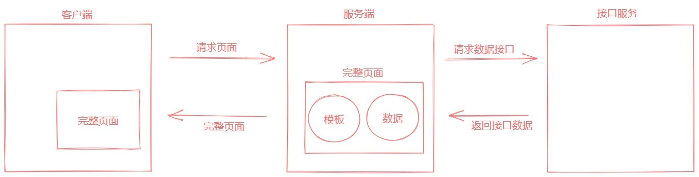

# [数据预取和状态](https://ssr.vuejs.org/zh/guide/data.html)

接下来我们来了解一下服务端渲染中的数据预取和状态管理。

[官方文档](https://ssr.vuejs.org/zh/guide/data.html) 中的描述比较枯燥，无法在很短的时间内搞清楚它到底要做什么，所以我们这里通过一个实际 的业务需求来引入这个话题。

我们的需求就是：

- 已知有一个数据接口，接口返回一个文章列表数据 我们想要通过服务端渲染的方式来把异步接口数据渲染到页面中
- 这个需求看起来是不是很简单呢？无非就是在页面发请求拿数据，然后在模板中遍历出来，如果是纯客 户端渲染的话确实就是这样的，但是想要通过服务端渲染的方式来处理的话就比较麻烦了。

无论如何，我们都要来尝试一下：



也就是说我们要在服务端获取异步接口数据，交给 Vue 组件去渲染。

我们首先想到的肯定是在组件的生命周期钩子中请求获取数据渲染页面，那我们可以顺着这个思路来试 一下。

在组件中添加生命周期钩子，beforeCreate 和 created，服务端渲染仅支持这两个钩子函数的调用。

然后下一个问题是如何在服务端发送请求？依然使用 axios，axios 既可以运行在客户端也可以运行在 服务端，因为它对不同的环境做了适配处理，在客户端是基于浏览器的 XMLHttpRequest 请求对象， 在服务端是基于 Node.js 中的 http 模块实现，无论是底层是什么，上层的使用方式都是一样的。

```javascript
// 服务端渲染
  //     只支持 beforeCreate 和 created
  //     不会等待 beforeCreate 和 created 中的异步操作
  //     不支持响应式数据
  // 所有这种做法在服务端渲染中是不会工作的！！！
  async created () {
    console.log('Posts Created Start')
    const { data } = await axios({
      method: 'GET',
      url: 'https://cnodejs.org/api/v1/topics'
    })
    this.posts = data.data
    console.log('Posts Created End')
  }
```

接下来我们就按照[官方文档](https://ssr.vuejs.org/zh/guide/data.html) 给出的参考来把服务端渲染中的数据预取以及状态管理来处理一下。

通过[官方文档](https://ssr.vuejs.org/zh/guide/data.html) 我们可以看到，它的核心思路就是把在服务端渲染期间获取的数据存储到 Vuex 容器中， 然后把容器中的数据同步到客户端，这样就保持了前后端渲染的数据状态同步，避免了客户端重新渲染 的问题。

所以接下来要做的第一件事儿就是把 Vuex 容器创建出来。

## 安装依赖

```
yarn add axios vuex
```

## 模拟接口

`service.js`

```javascript
service.post('/topics', (req, res) => {
  res.send({
    data: [
      {
        id: 1,
        title: '1',
      },
      {
        id: 2,
        title: '2',
      },
    ],
  });
});
```

## 创建 Vuex 容器

`src/store/index.js`

```javascript
/**
 * @author Wuner
 * @date 2020/10/28 15:20
 * @description
 */
import Vue from 'vue';
import Vuex from 'vuex';
import axios from 'axios';

Vue.use(Vuex);

export const createStore = () => {
  return new Vuex.Store({
    state: () => ({
      posts: [],
    }),

    mutations: {
      setPosts(state, data) {
        state.posts = data;
      },
    },

    actions: {
      // 在服务端渲染期间务必让 action 返回一个 Promise
      async getPosts({ commit }) {
        // return new Promise()
        const { data } = await axios.post('http://localhost:3000/topics');
        commit('setPosts', data.data);
      },
    },
  });
};
```

## 挂载

在通用应用入口中将 Vuex 容器挂载到 Vue 根实例
`src/app.js`

```javascript
/**
 * @author Wuner
 * @date 2020/9/8 17:51
 * @description
 */
import Vue from 'vue';
import App from './App.vue';
import { createRouter } from './router';
import VueMeta from 'vue-meta';
import { createStore } from './store';

Vue.use(VueMeta);

Vue.mixin({
  metaInfo: {
    titleTemplate: '%s - vue-ssr-demo',
  },
});

// 导出一个工厂函数，用于创建新的
// 应用程序、router 和 store 实例
export function createApp() {
  const router = createRouter();
  const store = createStore();
  const app = new Vue({
    router, // 把路由挂载到 Vue 根实例中
    store, // 把容器挂载到 Vue 根实例
    // 根实例简单的渲染应用程序组件。
    render: (h) => h(App),
  });
  return { app, router, store };
}
```

## 调用 action

在组件中使用 serverPrefetch 触发容器中的 action

`src/view/Posts.vue`

```vue
<template>
  <div>
    <h1>Post List</h1>
    <ul>
      <li v-for="post in posts" :key="post.id">{{ post.title }}</li>
    </ul>
  </div>
</template>

<script>
// import axios from 'axios'
import { mapState, mapActions } from 'vuex';

export default {
  name: 'PostList',
  metaInfo: {
    title: 'Posts',
  },
  data() {
    return {
      // posts: []
    };
  },
  computed: {
    ...mapState(['posts']),
  },
  // 客户端更新
  mounted() {
    if (!this.posts.length) {
      this.$store.dispatch('getPosts');
    }
  },
  beforeRouteLeave(to, from, next) {
    this.$store.commit('setPosts', []);
    next();
  },

  // Vue SSR 特殊为服务端渲染提供的一个生命周期钩子函数
  serverPrefetch() {
    // 发起 action，返回 Promise
    // this.$store.dispatch('getPosts')
    return this.getPosts();
  },
  methods: {
    ...mapActions(['getPosts']),
  },
  // 服务端渲染
  //     只支持 beforeCreate 和 created
  //     不会等待 beforeCreate 和 created 中的异步操作
  //     不支持响应式数据
  // 所有这种做法在服务端渲染中是不会工作的！！！
  // async created () {
  //   console.log('Posts Created Start')
  //   const { data } = await axios({
  //     method: 'GET',
  //     url: 'https://cnodejs.org/api/v1/topics'
  //   })
  //   this.posts = data.data
  //   console.log('Posts Created End')
  // }
};
</script>
```

## 服务端配置

在服务端渲染应用入口中将容器状态序列化到页面中

接下来我们要做的就是把在服务端渲染期间所获取填充到容器中的数据同步到客户端容器中，从而避免 两个端状态不一致导致客户端重新渲染的问题。

- 将容器中的 state 转为 JSON 格式字符串
- 生成代码：window.**INITIAL**STATE = 容器状态
- 语句插入模板页面中 【客户端通过 window.**INITIAL**STATE 获取该数据】

`src/entry-server.js`

```javascript
/**
 * @author Wuner
 * @date 2020/9/8 17:57
 * @description 服务端配置
 */
import { createApp } from './app';

// async...await
export default async (context) => {
  // 因为有可能会是异步路由钩子函数或组件，所以我们将返回一个 Promise，
  // 以便服务器能够等待所有的内容在渲染前，
  // 就已经准备就绪。
  const { app, router, store } = createApp();

  // 设置服务器端 router 的位置
  router.push(context.url);
  context.meta = app.$meta();

  // 等到 router 将可能的异步组件和钩子函数解析完
  await new Promise(router.onReady.bind(router));

  context.rendered = () => {
    // Renderer 会把 context.state 数据对象内联到页面模板中
    // 最终发送给客户端的页面中会包含一段脚本：window.__INITIAL_STATE__ = context.state
    // 客户端就要把页面中的 window.__INITIAL_STATE__ 拿出来填充到客户端 store 容器中
    context.state = store.state;
  };

  return app;
};
```

## 客户端配置

在客户端渲染入口中把服务端传递过来的状态数据填充到客户端 Vuex 容器中

`src/entry-client.js`

```javascript
/**
 * @author Wuner
 * @date 2020/9/8 17:55
 * @description 客户端配置
 */
import { createApp } from './app';

// 客户端特定引导逻辑……

const { app, router, store } = createApp();

// 如果当前页面中有 __INITIAL_STATE__ 数据，则直接将其填充到客户端容器中
if (window.__INITIAL_STATE__) {
  store.replaceState(window.__INITIAL_STATE__);
}

// 这里假定 App.vue 模板中根元素具有 `id="app"`
router.onReady(() => {
  app.$mount('#app');
});
```
