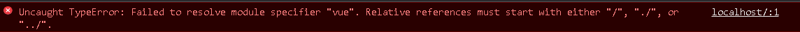
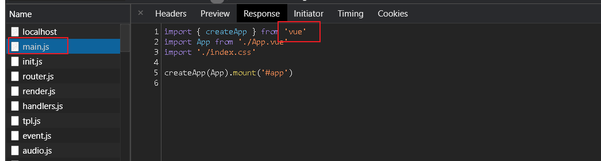
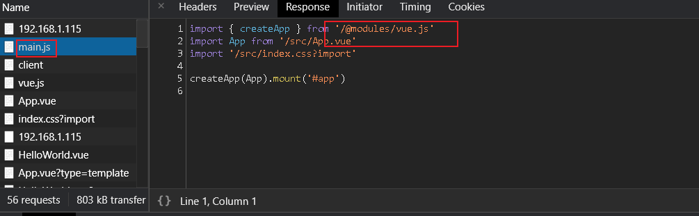
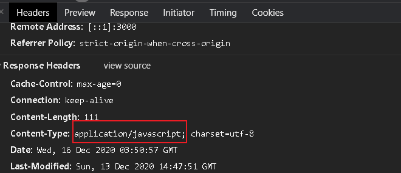
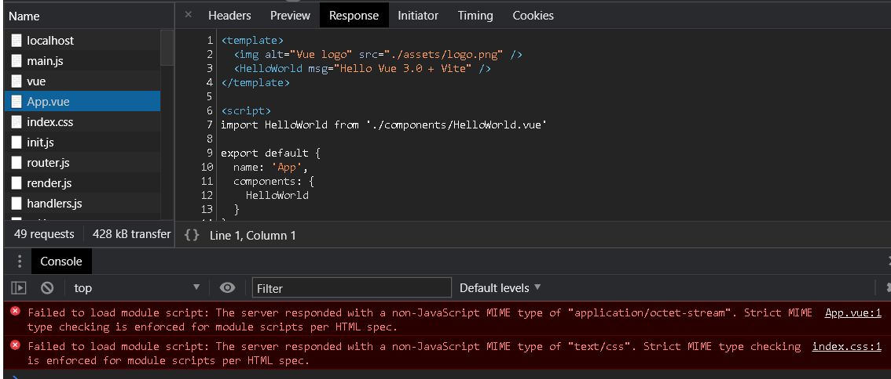
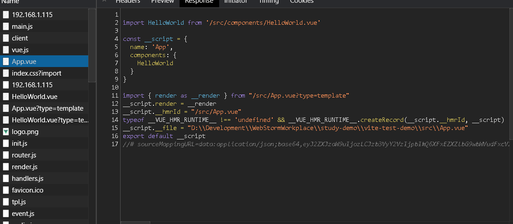
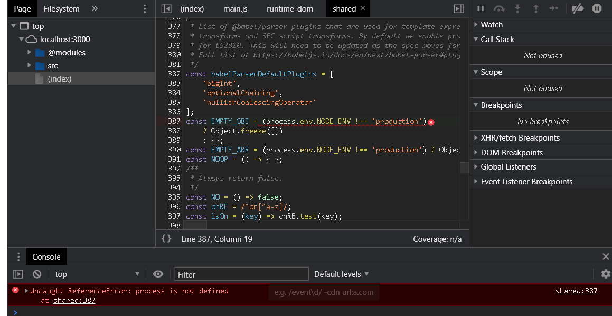

# 模拟 Vite

## Vite 核心功能

- 静态 Web 服务器
  - 编译单文件组件
  - 拦截浏览器不识别的模块，并处理
- HMR

## Vite 工作步骤

当启动 Vite 的时候，首先会将当前项目目录作为静态 web 服务器的根目录。

静态 web 服务器会拦截部分请求，例如当请求单文件组件的时候会实时编译，以及处理其他浏览器不能识别的模块（非 JS 模块）。

通过 web socket 实现 HMR（暂不模拟）。

## 创建 Vue3.x 项目

用于测试我们模拟的 vite 工具

### npm

```shell
npm init vite-app vite-test-demo
cd vite-test-demo
npm i
```

### yarn

```shell
yarn create vite-app vite-test-demo
cd vite-test-demo
yarn
```

## 初始化 wuner-vite-cli

```shell
mkdir wuner-vite-cli
cd wuner-vite-cli
echo '' >index.js
yarn init -y
```

## 安装依赖

Vite 内部使用 Koa 开启静态 Web 服务器。

koa-send：静态文件处理的中间件。

```shell
yarn add koa koa-send
```

## 配置

配置 `bin` 字段，默认执行的 js 文件的路径：

`package.json`

```json
{
  "name": "wuner-vite-cli",
  "version": "1.0.0",
  "main": "index.js",
  "bin": "index.js",
  "license": "MIT",
  "dependencies": {
    "koa": "^2.13.0",
    "koa-send": "^5.0.1"
  }
}
```

## 静态 web 服务器

使用 `koa` 开发静态 `web` 服务器，默认返回根目录中的 `index.html`

创建一个中间件，负责处理静态文件，默认加载当前目录下（运行该命令行工具的目录中的 `index.html`）。

`index.js`

```js
#!/usr/bin/env node

const Koa = require('koa');
const send = require('koa-send');

// 创建实例
const app = new Koa();

// 1. 开启静态文件服务器
app.use(async (ctx, next) => {
  await send(ctx, ctx.path, {
    root: process.cwd(),
    index: 'index.html',
  });
  await next();
});

app.listen(3000);
console.log('Server running @ http://localhost:3000');
```

## link

`wuner-vite-cli` 根目录下运行

```shell
# npm
npm link
# yarn
yarn link
```

## 测试

在 `vite-test-demo` 根目录下运行

```shell
wuner-vite-cli
```

使用浏览器访问 http://localhost:3000

这时你将看到报错，如下图





在导入 vue 模块的时候，前面没有浏览器要求的相对路径地址（"/", "./", or "../"）。

这种方式的导入，期望的是从 node_modules 中加载模块，这是打包工具的默认行为，但是浏览器不支持。

### vite 解决方案

使用 `vite` 运行 `vite-test-demo` 查看：

```shell
vite
```




通过查看 main.js 的 http 请求，我们可以看出 Vite 开启的 web 服务器在加载 main.js 时首先会处理第三方模块的 import 路径：vue => /@modules/vue.js；响应头 Response Headers 返回的 Content-Type 是 application/javascript，作用是告诉浏览器返回的文件是 JavaScript 文件。

所以要在 web 服务器输出之前，先判断一下当前返回的文件是否是 JS 文件。 如果是 JS 文件，再去处理里面第三方模块的路径。 然后在请求 /@modules/vue.js 时处理这个不存在的路径，去 node_modules 中寻找对应的文件。

## 修改第三方模块的路径

```js
#!/usr/bin/env node

const Koa = require('koa');
const send = require('koa-send');

// 创建实例
const app = new Koa();

/**
 * 流转化成字符串
 * @param stream
 * @returns {Promise}
 */
const streamToString = (stream) =>
  // 读取流是一个异步的过程,所以要返回一个 Promise
  new Promise((resolve, reject) => {
    // chunks 存储读取到的 Buffer
    const chunks = [];

    // 监听读取到的 Buffer
    stream.on('data', (chunk) => chunks.push(chunk));

    // 监听读取完毕,将 Buffer 转化成字符串
    stream.on('end', () => resolve(Buffer.concat(chunks).toString('utf-8')));

    // 监听读取失败
    stream.on('error', reject);
  });

// 1. 开启静态文件服务器
app.use(async (ctx, next) => {
  await send(ctx, ctx.path, {
    root: process.cwd(),
    index: 'index.html',
  });
  await next();
});

// 2. 修改第三方模块的路径
app.use(async (ctx, next) => {
  // 判断是否是 JS 文件
  if (ctx.type === 'application/javascript') {
    // ctx.body 是返回给浏览器的 JS 文件,是一个流,要转化成字符串处理
    const contents = await streamToString(ctx.body);
    // 替换路径并重新赋值 ctx.body
    // 替换 `from '` 为 `from '/@modules/`
    ctx.body = contents.replace(/(from\s+['"])(?![\.\/])/g, '$1/@modules/');
  }
});

app.listen(3000);
console.log('Server running @ http://localhost:3000');
```

### 测试

重新运行脚本测试

```shell
wuner-vite-cli
```


如上图所示，我们已经成功修改了 vue 模块加载路径，但是浏览器不识别，我们需要在服务器去加载第三方模块。

## 加载第三方模块

```js
#!/usr/bin/env node

const Koa = require('koa');
const send = require('koa-send');
const path = require('path');

// 创建实例
const app = new Koa();

/**
 * 流转化成字符串
 * @param stream
 * @returns {Promise}
 */
const streamToString = (stream) =>
  // 读取流是一个异步的过程,所以要返回一个 Promise
  new Promise((resolve, reject) => {
    // chunks 存储读取到的 Buffer
    const chunks = [];

    // 监听读取到的 Buffer
    stream.on('data', (chunk) => chunks.push(chunk));

    // 监听读取完毕,将 Buffer 转化成字符串
    stream.on('end', () => resolve(Buffer.concat(chunks).toString('utf-8')));

    // 监听读取失败
    stream.on('error', reject);
  });

// 3. 加载第三方模块
app.use(async (ctx, next) => {
  // 判断路径是否是以 `/@odules/` 开头
  if (ctx.path.startsWith('/@modules/')) {
    // 截取模块名称
    const moduleName = ctx.path.substr(10);

    // 获取模块的入口文件(ESM模块的入口文件)
    // 先找到这个模块的 package.json,再获取module字段的值
    const pkgPath = path.join(
      process.cwd(),
      'node_modules',
      moduleName,
      'package.json',
    );
    const pkg = require(pkgPath);
    ctx.path = path.join('/node_modules', moduleName, pkg.module);
  }
  await next();
});

// 1. 开启静态文件服务器
app.use(async (ctx, next) => {...});

// 2. 修改第三方模块的路径
app.use(async (ctx, next) => {...}
});

app.listen(3000);
console.log('Server running @ http://localhost:3000');
```

### 测试

重新运行脚本测试



如上图所示，`vue` 模块已成功被加载到，但是有两个浏览器不能识别的模块加载失败 `App.vue` 和 `index.css`

本次只模拟 js 类型处理，我们将注释 css 与 img 引用

### Vite 解决方案

浏览器只能处理 JS 模块，所以通过 import 加载的其他模块都需要在服务器端处理。

当请求单文件组件的时候，需要在服务器上把单文件组件编译成 JS 模块，然后返回给浏览器。




如上图所示，Vite 中处理单文件组件会发送两次请求：

- 第一次请求把单文件组件编译成对象
- 第二次请求编译单文件组件的模板，返回一个 render 函数，并挂载到第一次请求编译的对象的 render 属性上

## 编译 vue 单文件组件

安装 vue 3.x 编译单文件组件的模块 compiler-sfc

```shell
#npm
npm i @vue/compiler-sfc
#yarn
yarn add @vue/compiler-sfc
```

```js
#!/usr/bin/env node

const Koa = require('koa');
const send = require('koa-send');
const path = require('path');
const compilerSFC = require('@vue/compiler-sfc');
const { Readable } = require('stream');

// 创建实例
const app = new Koa();

/**
 * 流转化成字符串
 * @param stream
 * @returns {Promise}
 */
const streamToString = (stream) =>...

/**
 * 字符串转化成流
 * @param text
 * @returns {*}
 */
const stringToStream = (text) => {
  const stream = new Readable();
  stream.push(text);
  // 标识 stream 已写完
  stream.push(null);
  return stream;
};

// 3. 加载第三方模块
app.use(async (ctx, next) => {...});

// 1. 开启静态文件服务器
app.use(async (ctx, next) => {...});

// 4. 处理单文件组件
// 在获取文件之后,处理第三方模块之前
app.use(async (ctx, next) => {
  // 判断是否是单文件组件
  if (ctx.path.endsWith('.vue')) {
    const contents = await streamToString(ctx.body);
    // Vue 2 的 compiler 返回一个 AST 对象
    // Vue 3 的 compiler 返回一个包含 descriptor 和 errors 的对象
    const { descriptor } = compilerSFC.parse(contents);

    let code;
    if (!ctx.query.type) {
      // 第一次请求
      code = descriptor.script.content;

      // 改造code
      code = code.replace(/export\s+default\s+/g, 'const __script = ');

      // 拼接代码
      code += `
      import {render as __render} from "${ctx.path}?type=template"
      __script.render = __render
      export default __script
      `;
    } else if (ctx.query.type === 'template') {
      // 第二次请求
      const templateRender = compilerSFC.compileTemplate({ source: descriptor.template.content });
      code = templateRender.code;
    }
    // 告诉浏览器以 JS 方式识别该返回
    ctx.type = 'application/javascript';

    // 将code转换成流输出给浏览器
    ctx.body = stringToStream(code);
  }
  await next();
});

// 2. 修改第三方模块的路径
app.use(async (ctx, next) => {...});

app.listen(3000);
console.log('Server running @ http://localhost:3000');
```

### 测试

重新运行脚本测试



如上图所示，源码中使用了 process.env.NODE_ENV。

当前代码是在浏览器环境下执行的，process 是 node 环境的对象，浏览器环境没有这个对象，所以报错。

这段源码的作用是让打包工具根据环境变量分别进行生产环境或者开发环境的打包操作。

但是现在没有用打包工具，所以这句代码没有被处理，直接返回给了浏览器。

所以应该在服务器处理一下，在返回 JS 模块之前，应该把 JS 模块中所有 process.env.NODE_ENV 都替换成 development（因为当前是开发环境下）。

## 替换 vue 模块中的环境变量

```js
#!/usr/bin/env node

const Koa = require('koa');
const send = require('koa-send');
const path = require('path');
const compilerSFC = require('@vue/compiler-sfc');
const { Readable } = require('stream');

// 创建实例
const app = new Koa();

/**
 * 流转化成字符串
 * @param stream
 * @returns {Promise}
 */
const streamToString = (stream) =>...

/**
 * 字符串转化成流
 * @param text
 * @returns {*}
 */
const stringToStream = (text) => {...};

// 3. 加载第三方模块
app.use(async (ctx, next) => {...});

// 1. 开启静态文件服务器
app.use(async (ctx, next) => {...});

// 4. 处理单文件组件
// 在获取文件之后,处理第三方模块之前
app.use(async (ctx, next) => {...});

// 2. 修改第三方模块的路径
app.use(async (ctx, next) => {
  // 判断是否是 JS 文件
  if (ctx.type === 'application/javascript') {
    // ctx.body 是返回给浏览器的 JS 文件,是一个流,要转化成字符串处理
    const contents = await streamToString(ctx.body);
    // 替换路径并重新赋值 ctx.body
    // 替换 `from '` 为 `from '/@modules/`
    ctx.body = contents
      .replace(/(from\s+['"])(?![\.\/])/g, '$1/@modules/')
      // 继续替换 process 对象
      .replace(/process\.env\.NODE_ENV/g, '"development"');
  }
});

app.listen(3000);
console.log('Server running @ http://localhost:3000');
```

### 测试

重新运行脚本测试


如上图所示，我们已经可以正常显示页面了

## [源码](https://gitee.com/Wuner/wuner-vite-cli)
